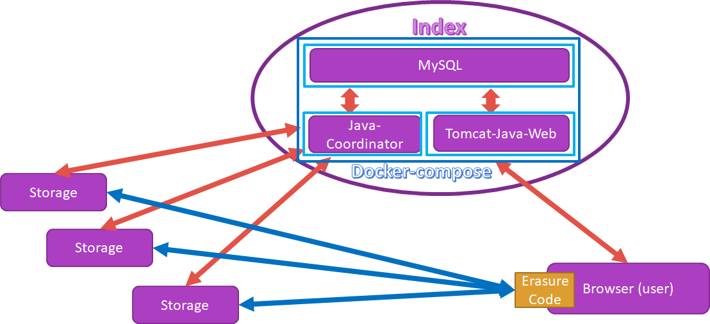
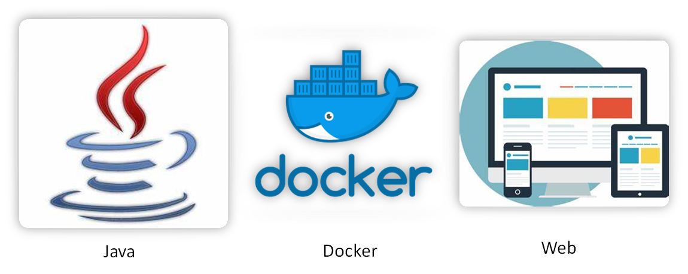
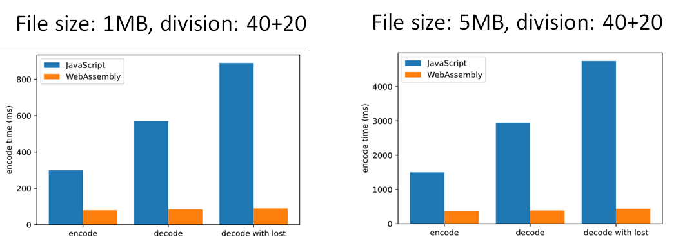
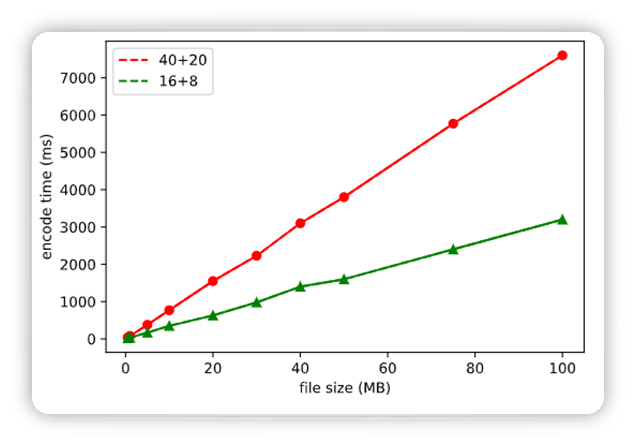
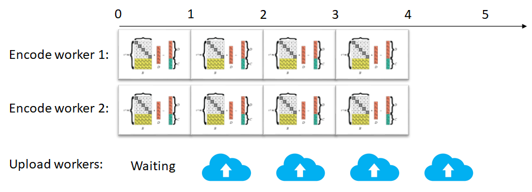
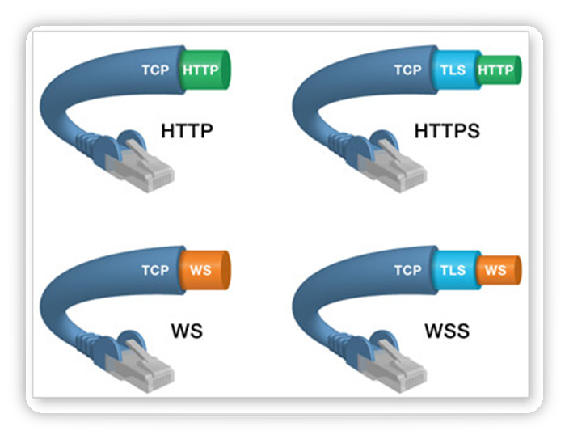

[TOC]

# 结题报告

## 项目介绍

本项目旨在实现可用性高的基于互联网网页的小型分布式文件系统。为了减少不必要的重复劳动，本项目基于[往届 OSH 项目](https://github.com/IngramWang/DFS_OSH2017_USTC)进行优化。在已有的项目的基础上，实现容器化服务器端、多用户权限支持、更高效的文件传输、减轻中央服务器负担、提高文件安全性和可用性等优化。一方面做出易于部署可用性高的“私人网盘”，另一方面也为用户群的扩展和服务推广留出了上升空间。

## 立项依据

随着社会经济的发展与信息化进程的继续，台式计算机、膝上电脑、智能手机、平板电脑和更多的智能可穿戴设备正疯狂涌入当前的家庭和小微企业。这些设备极大地提高了企业的办公效率、丰富了家庭的娱乐需求，但如何高效地利用分散在这些不同的设备上的存储空间如今正越发成为大家关注的问题：运用好这些分散的存储空间不仅可以方便多人合作，更可以避免资源的浪费。

而家庭和小微企业的存储设备有如下特点：

\- 存储资源小而分散，每个设备的存储容量通常不超过 1 TB；
\- 设备通常只有在使用时才会在线联网，否则处于关闭状态；
\- 很多设备的位置随时间而变化，故它们常常并不总在其归属网络上；
\- 和专用的服务器相比，这些设备的性能较低；
\- 设备没有统一的指令集和操作系统；
\- 连接设备的网络环境较差，往往通过一般的局域网或互联网相连接。

面对这些特点，很难用一个集中式的文件系统组织分散在这些不同的设备上的存储空间。

然而，即使是传统的分布式文件系统想在这种环境中应用也是十分困难的，这体现在：

\- 传统的分布式文件系统往往要求高性能、稳定的服务器，而上述环境中的机器不但性能不足，更不常在线；
\- 传统的分布式文件系统往往要求服务器具有相同的操作系统甚至是定制的操作系统以方便管理，而上述环境中的机器运行不同的操作系统上；

同时，各大商业网盘的安全性深受质疑，限速或者收费等限制并不能很好地满足我们对存储的需要。

总而言之：

1. 个人/家庭有使用分布式存储提高数据安全性的需求，同时有分散在若干个人设备的碎片化存储资源可以利用。
2. 传统的分布式文件系统并不适用于小型私有云场景。
3. 各种个人搭建私有云的方案可移植性较差，且部署需要较多配置。

面对前述现状，我们希望在前人的试验基础上，实现可用性更高的、可移植性更强的、基于互联网的小型分布式文件系统，在上述应用环境中提供比免费网盘更好的服务。

## 项目设计

### 项目结构




我们的项目从 IPFS 中吸取了 P2P 的思想，在数据的传输上实现了点对点。文件系统由一个目录节点（index）和若干存储节点（storage）组成。目录节点负责提供 web 管理界面，以及协调各存储节点的资源。这样的数据存储和传输方式能够有效节约带宽资源，避免传统 server/client 模式中中央服务器负载过重产生的瓶颈。（像我们参考的另一个大作业项目，就存在中央服务器数据传输瓶颈的问题。）同时，文件内容也不会经过目录节点，不用担心权力集中和监管的弊端。

因为目录节点的存在，我们能够对访问者进行身份验证，对数据的冗余备份进行协调，不会产生IPFS 中的安全性问题和可靠性问题。

相对于 NAS 较差的扩展性，由于本项目各节点之间的连接基于互联网，这非常有利于存储节点的接入和用户群的扩展。有更多的用户参与成为存储节点也会进一步提高系统的稳定性和可用性。



考虑到易用性，我们将目录节点运行的服务用 docker 容器进行封装，一方面解决了适配不同环境的问题提高了兼容性，另一方面也使一键部署成为可能。

只要一台设备运行我们的 client 就可以作为存储节点接入分布式文件系统。client 使用 Java 编写，利用 JVM 虚拟机的跨平台兼容能力，凡是能运行 Java 的设备都可以成为存储节点。尤其是个人电脑的各种操作系统，无论 Windows、Mac OS、Linux 都可以兼容。这意味着使用者可以将任意的闲置资源方便地贡献为存储结点，这或将大大提升未来私人部署网盘的占有率，更能避免对商业云存储的依赖。

同样是处于易用性的考虑，我们提供 web 界面进行文件管理操作，一方面可以避免安装客户端的麻烦，有的时候正是懒得额外下载一个客户端劝退了潜在用户。另一方面我们也利用了 web 天然的跨平台兼容性优势。

这样一来从部署目录节点、接入存储节点到管理文件，整个系统操作都相当便捷，非常有利于自行部署搭建服务。

### Docker 部署服务端

#### 容器化技术

在生产环境上，传统的手工部署方法可能会出现下列事件：

- 你的 Linux 发行版很老，而你需要运行一个给新版本的 Linux 或者完全不同的 Linux 发行版设计的程序。
- 你和朋友一起设计一个大型程序，由于你们的运行环境不同，有时候在某台机器上正常运行的程序，在另一台机器上没法正常运行。
- 你希望在多台服务器上部署同一个项目，但是项目需要非常复杂的配置，一个一个配置服务器的成本非常大。

而容器化技术可以方便解决上述问题，容器可以把应用及其依赖项都将打包成一个可以复用的镜像并与其他进程环境隔离。

在运行环境、网络拓扑、安全策略和存储方案变化时，软件可能会显现一些出乎意料的问题；而容器使开发环境和运行环境统一。同时容器并不像虚拟机那样模拟全部硬件（这对于很多轻量型应用是小题大做），它只虚拟化了文件系统、网络、运行环境等，在核心本地运行指令，不需要任何专门的接口翻译和系统调用替换机制，减少了很多虚拟化开销。

现有容器软件有 LXC/LXD、Docker、Solaris Zones、Kubernetes 等等。

#### 实现原理

CGroup（Control Groups）是 Linux 内核提供的一种可以限制、记录、隔离进程组使用的资源的系统。CGroup 将任意进程进行分组化管理，有内存控制器、进程调度控制器、虚拟文件系统等。运行中的内核可以用 CGroup 的子系统 /proc/cgroup 来确认。

Namespace，包括 CLONE_NEWCGROUP、CLONE_NEWIPC、CLONE_NEWNET、CLONE_NEWNS、CLONE_NEWPID、CLONE_NEWUSER、CLONE_NEWUTS 这七个选项，是对全局系统资源的一种封装隔离。处于不同 Namespace 的进程拥有独立的全局系统资源，改变一个 Namespace 中的系统资源只会影响当前 Namespace 里的进程，对其他 Namespace 中的进程没有影响。内核将这些命名空间保存在 /proc/[pid]/ns/ 目录下。

#### 为什么使用 Docker

[](https://github.com/OSH-2020/x-dontpanic/blob/master/docs/files/research-docker.png)

Docker 使用了 CGroup 和 Namespace 去隔离不同容器内的进程。Docker 容器将应用和其依赖环境打包在一起，在不包含完整的操作系统时就能运行普通应用，更加轻量级，可移植性更好。Docker 的可移植性和轻量级的特性，可以使我们轻松地完成动态管理的工作负担，并根据需求指示，实时扩展或拆除应用程序和服务。

Docker 中的每一个镜像都是由一系列的只读层组成的，Dockerfile 中的每一个命令都会在已有的只读层上创建一个新的层。`docker run` 可以在镜像的最上层添加一个可写的容器层，所有运行时容器的修改其实都是对这个容器读写层的修改。这样的特性使得 Docker 具有一定版本管理的功能。

#### 使用 Docker 创建容器

本项目使用了 Apache 和 Tomcat，使用网页作为用户的交互页面。Apache 作为一个 Web 服务器，缺乏处理 JSP 的功能，为了能够处理 JSP 的请求，需要使用 JSP 容器如 Tomcat。mod_jk（JK）是 Apache 与 Tomcat 的连接器，附带集群和负载均衡。就 Docker 而言，应该对每个服务使用单独容器，如 Web 服务器运行在一个容器上，应用程序服务器运行在另一个容器上。若采用 Apache 和 Tomcat 方案分别部署 HTML 和 JSP 页面，则容易使用 Docker 分别管理 Apache 和 Tomcat，动静分离。

使用 Docker 创建容器时，基础镜像通常是 Ubuntu 或 Centos，不管哪个镜像的大小都在 100MB 以上。Alpine Linux 采用了 musl libc 和 busybox 以减小系统的体积和运行时消耗，相比于其他 Linux 的 Docker 镜像，它的占用仅仅只有 5MB。故项目会采用 docker-alpine-java 镜像，同时提供 JRE 运行时和较小的镜像体积。

#### Docker Compose

Compose 是用于定义和运行多容器 Docker 应用程序的工具。

在小型的部署中，它提高了易用性，使用者可以轻松地部署一个轻量的目录节点。

当我们想进行用户群的扩展时，需要面临目录节点处理高并发的问题，此时 docker-compose 还可以为扩容提供便利。我们可以将容器分散到不同的机器上，并且利用 docker-compose 支持的 scale 功能创建多个实例并进行负载均衡，达到高性能。

使用容器技术很好地简化了目录节点的配置，同时还可以减少开发环境和部署环境不同带来的问题。很多时候人们可能因为配置文档过于复杂，或者因为环境问题配置失败，就放弃了一个服务。提供一键部署的方案，降低了部署的成本和学习门槛，非常有利于项目的推广。


### 文件编解码

#### Reed-Solomon 编码

纠删码（Erasure Code）是一种编码技术。它通过计算将 n 份原始数据增加至 n+m 份数据，并能由其中的任意 n 份数据还原出原始数据，即可以容忍不多于 m 份的数据失效。纠删码主要应用在网络传输中，用以提高存储系统的可靠性。相比多副本复制而言，它能以更小的数据冗余度获得更高数据可靠性， 但编码方式较复杂，需要大量计算。

里德-所罗门码（Reed-Solomon codes，RS codes）是纠删码的一类，常被应用在分布式文件系统中，我们希望使用它来提升文件系统的可靠性。下面介绍它的编解码原理。

#### 编解码原理

##### 编码

RS 编码以 word 为编码和解码单位，大的数据块拆分到字长为 w（取值一般为 8 或者 16 位）的 word，然后对 word 进行编解码。数据块的编码原理与 word 编码原理相同。把输入数据视为向量 D = (D1, D2, .., Dn), 编码后数据视为向量 (D1, D2, .., Dn, C1, C2, .., Cm)，RS 编码可视为如下图所示矩阵运算。

[](https://github.com/OSH-2020/x-dontpanic/blob/master/docs/files/research-RS-1)

上图最左边是编码矩阵（或称为生成矩阵、分布矩阵，Distribution Matrix），编码矩阵需要满足任意 n*n 子矩阵可逆。为方便数据存储，编码矩阵上部是单位阵，下部是 m*n 矩阵。下部矩阵可以选择范德蒙德矩阵或柯西矩阵。

##### 解码

RS 最多能容忍 m 个数据块被删除，数据恢复的过程如下：

- 假设 D1、D4、C2 丢失，从编码矩阵中删掉丢失的数据块/编码块对应的行。根据 RS 编码运算等式，可以得到 B' 以及等式：

[](https://github.com/OSH-2020/x-dontpanic/blob/master/docs/files/research-RS-2-new)

- 由于 B' 是可逆的，记 B' 的逆矩阵为 B'^(-1)，则 B'*B'^(-1) = I 单位矩阵。两边左乘 B' 逆矩阵：

[](https://github.com/OSH-2020/x-dontpanic/blob/master/docs/files/research-RS-4)

- 得到如下原始数据 D 的计算公式，从而恢复原始数据 D：

[](https://github.com/OSH-2020/x-dontpanic/blob/master/docs/files/research-RS-5-new)

#### 编码矩阵

##### 基于范德蒙德（Vandermonde）矩阵

在线性代数中有一种矩阵称为范德蒙德矩阵，它的任意的子方阵均为可逆方阵。

一个 m 行 n 列的范德蒙德矩阵定义如下图左边，其中 Ai 均不相同，且不为 0。令 A1, A2, .., An 分别为 1, 2, 3, .., n，则得到范德蒙德矩阵为下图右边：

[](https://github.com/OSH-2020/x-dontpanic/blob/master/docs/files/feasibility-RS-Vandermonde-1)

编码矩阵就是单位矩阵和范德蒙德矩阵的组合。输入数据 D 和编码矩阵的乘积就是编码后的数据。

采用这种方法的算法复杂度还是比较高的，编码复杂度为 O(mn)，其中 m 为校验数据个数，n 为输入数据个数。解码复杂度为 O(n^3)。

##### 基于柯西（Cauchy）矩阵

柯西矩阵的任意一个子方阵都是奇异矩阵，存在逆矩阵。而且柯西矩阵在迦罗华域上的求逆运算，可以在 O(n^2) 的运算复杂度内完成。使用柯西矩阵，比范德蒙德矩阵的优化主要有两点：

- 降低了矩阵求逆的运算复杂度。范德蒙矩阵求逆运算的复杂度为 O(n^3)，而柯西矩阵求逆运算的复杂度仅为 O(n^2)。
- 通过有限域转换，将 GF(2^w) 域中的元素转换成二进制矩阵，将乘法转换为逻辑与，降低了乘法运算复杂度。（二进制的加法即 XOR，乘法即 AND）

柯西矩阵的描述如下图左边，Xi 和 Yi 都是迦罗华域 GF(2^w) 中的元素。右边是基于柯西矩阵的编码矩阵：

[](https://github.com/OSH-2020/x-dontpanic/blob/master/docs/files/feasibility-RS-Cauchy-1-new.png)

##### 柯西编解码过程优化

在范德蒙编码的时候，我们可以采用对数/反对数表的方法，将乘法运算转换成了加法运算，并且在迦罗华域中，加法运算转换成了 XOR 运算。

柯西编解码为了降低乘法复杂度，采用了有限域上的元素都可以使用二进制矩阵表示的原理，将乘法运算转换成了迦罗华域“AND 运算”和“XOR 逻辑运算”，提高了编解码效率。

从数学的角度，在迦罗华有限域中，任何一个 GF(2^w) 域上的元素都可以映射到 GF(2) 二进制域，并且采用一个二进制矩阵的方式表示 GF(2^w) 中的元素。例如 GF(2^3) 域中的元素可以表示成 GF(2) 域中的二进制矩阵：

[](https://github.com/OSH-2020/x-dontpanic/blob/master/docs/files/feasibility-RS-GF-1)

上图中，黑色方块表示逻辑 1，白色方块表示逻辑 0。通过这种转换，GF(2^w) 域中的阵列就可以转换成 GF(2) 域中的二进制阵列。生成矩阵的阵列转换表示如下：

[](https://github.com/OSH-2020/x-dontpanic/blob/master/docs/files/feasibility-RS-GF-2)

在 GF(2^w) 域中的编码矩阵为 K*(K+m)，转换到 GF(2) 域中，使用二进制矩阵表示，编码矩阵变成了 wk*w(k+m) 二进制矩阵。采用域转换的目的是简化 GF(2^w) 域中的乘法运算。在 GF(2) 域中，乘法运算变成了逻辑与运算，加法运算变成了 XOR 运算，可以大大降低运算复杂度。

和范德蒙编解码中可能使用的对数/反对数方法相比，这种方法不需要构建对数或反对数表，可以支持 w 为很大的 GF 域空间。采用这种有限域转换的方法之后，柯西编码运算可以表示如下：

[](https://github.com/OSH-2020/x-dontpanic/blob/master/docs/files/feasibility-RS-GF-3)

使用柯西矩阵要优于范德蒙德矩阵的方法，柯西矩阵的运算复杂度为 O(n*(n-m))，解码复杂度为 O(n^2)。

#### 开源纠删码项目

纠删码本身目前已经是一种比较成熟的算法，且其中的 Reed-Solomon 算法是比较早并且已经有开源实现的一种算法，相对引入系统的难度较低。此外，为了在浏览器端实现文件编解码以减少服务器的工作量，我们希望应用 WebAssembly 编译现有的开源算法。

我们分别尝试了用 JavaScript 和 WebAssembly 在浏览器上做纠删码。其中 JavaScript 直接基于[开源的实现](https://github.com/ianopolous/ErasureCodes)进行了一些修改。

数据储存服务供应商 Backblaze 在 GitHub 开源提供了一个使用 Java 编写的 Reed-Solomon 库。以此为基础实现了许多其他语言如 Go、Python 编写的 RS 纠删码项目，其中 [Go 语言的实现](https://github.com/klauspost/reedsolomon)有较多的 Star 量，内容也较为完善。为了在网页中应用项目中的函数，我们利用它编写了 Go 语言代码编译成 WebAssembly 格式，这部分内容在后面介绍。

#### WebAssembly

WebAssembly 是一个实验性的低级编程语言，应用于浏览器内的客户端。

在过去很长一段时间里，JavaScript 是 Web 开发人员中的通用语言。如果想写一个稳定成熟的 Web 应用程序，用 JavaScript 几乎是唯一的方法。WebAssembly（也称为 wasm）将很快改变这种情况。它是便携式的抽象语法树，被设计来提供比 JavaScript 更快速的编译及运行。

 WebAssembly 将让开发者能运用自己熟悉的编程语言（最初以 C/C++ 作为实现目标）编译，再藉虚拟机引擎在浏览器内运行。

WebAssembly 的开发团队分别来自 Mozilla、Google、Microsoft、Apple，代表着四大网络浏览器 Firefox、Chrome、Microsoft Edge、Safari。2017 年 11 月，以上四个浏览器都开始实验性地支持 WebAssembly。WebAssembly 于 2019 年 12 月 5 日成为万维网联盟（W3C）的推荐，与 HTML、CSS 和 JavaScript 一起，成为 Web 的第四种语言。

#### WebAssembly 与 JavaScript 效率对比

在项目 demo 完成后，我们对 WebAssembly 和 JavaScript 代码的效率进行测试得到了两组对比的 benchmark，两组对文件大小的参数进行了更改。可以看到在 WebAssembly 上实现的纠删码效率远远高于 JavaScript，编码速率提升将近 4 倍，而解码提升了 7 倍左右。当有一块文件块缺失时，WebAssembly 的解码效率提升了 10 倍。



#### 浏览器端实现文件编解码

##### 使用 FileReader 获取本地文件

通过使用在 HTML5 中加入到 DOM 的 File API，用户可以在 web 内容中选择本地文件然后读取这些文件的内容。FileReader 对象允许Web 应用程序异步读取存储在用户计算机上的文件（或原始数据缓冲区）的内容，使用 File 或 Blob 对象指定要读取的文件或数据。

我们成功读取文件后，记录它的文件名、大小、设置的分块数等信息，另外需要将其转换为 Uint8Array 格式，这是因为在 Go 接收 JavaScript 传递的数据时，需要通过 CopyBytesToGo 方法拷贝数据到 Go 的对象中，这个方法要求传递 Uint8Array 类型的数据。在 JavaScript 版本的代码中，也要将原始文件内容转换为 Uint8Array 编码。

之后，我们创建 Worker 线程，在其中调用 JavaScript 或者由 Go-WebAssembly 导出的函数进行文件编码，并生成碎片的 MD5 摘要。

##### Go-WebAssembly：使用 syscall/js 包编写源代码

Go 提供了专有 API syscall/js 包，使我们可以与 JavaScript 之间传递函数与数据。来源于 JavaScript 的数据在 Go 中会是 js.Value 类型，需要使用包里的函数进行转换。除了通过上一节提到的 CopyBytesToGo 方法拷贝 JavaScript 数据到 Go 的对象中，我们还会用到 CopyBytesToJS 将运算结果返回给 JavaScript，以及 FuncOf 用于包装 Go 函数，等等。

在 Go 代码中，我们接收 Uint8Array 类型数据，并提供三个函数给 JavaScript 使用：

- callEncoder 用于编码；
- callDecoder 用于解码；
- callMd5 用于计算碎片的 MD5 值，从而在解码时判断碎片内容是否发生了改变。

这三个函数将会完成数据类型的转换和 Go 函数的调用。在 main() 函数中声明这些函数，并阻止 Go 程序退出。

~~~go
func main() {
	c := make(chan struct{}, 0)
	js.Global().Set("callMd5",js.FuncOf(callMd5))
	js.Global().Set("callEncoder",js.FuncOf(callEncoder))
	js.Global().Set("callDecoder",js.FuncOf(callDecoder))
	<-c
}
~~~

接下来分别简述 Go-WebAssembly 的三个函数。

##### callEncoder：接收原始数据并调用 Go 函数编码

为了能将 Go 函数传递给 JavaScript 使用，Go 函数的参数和返回值类型在[js 包文档](https://golang.org/pkg/syscall/js/#FuncOf)中有固定格式的要求。

~~~go
func FuncOf(fn func(this Value, args []Value) interface{}) Func
~~~

这意味着 JavaScript 和 Go 的数据需要经过一些转换。callEncoder 函数声明为：

~~~go
func callEncoder(this js.Value, args []js.Value) interface{}
~~~

而在 JavaScript 代码中调用 callEncoder 函数时，我们接收 JavaScript 中 Uint8Array 类型的原始文件数据，以及进行纠删码编码需要的原始数据块、冗余块两个参数，并传递给 goEncoder 以调用 Go 开源库的函数。

~~~go
buffer := make([]byte, args[0].Length())
js.CopyBytesToGo(buffer, args[0])
content := goEncoder(buffer, args[1].Int(), args[2].Int())
~~~

得到编码后的数组（content）后，再调用 CopyBytesToJS 函数转换成 js.Value 类型，于是函数的返回值能在 JavaScript 代码中直接使用。

~~~go
jsContent := make([]interface{},len(content))
for i:=0; i<len(content); i++{
    jsContent[i] = js.Global().Get("Uint8Array").New(len(content[0]))
    js.CopyBytesToJS(jsContent[i].(js.Value),content[i])
}
return js.ValueOf(jsContent)
~~~

在 goEncoder 函数中，我们可以直接使用[开源库](https://github.com/klauspost/reedsolomon)中的函数进行编码。为了在生成编码矩阵时使用性能上更好的柯西矩阵，参照[说明文档](https://pkg.go.dev/github.com/klauspost/reedsolomon?tab=doc#WithAutoGoroutines)加入 WithCauchyMatrix() 参数。编码得到的结果返回给 callEncoder 函数进行格式转换。

~~~go
func goEncoder(raw []byte, numOfDivision int, numOfAppend int)(content [][]byte){
	enc, err := reedsolomon.New(numOfDivision, numOfAppend, reedsolomon.WithCauchyMatrix())
	checkErr(err)
	content, err = enc.Split(raw)
	checkErr(err)
	err = enc.Encode(content)
	checkErr(err)
	return content
}
~~~

##### callMD5：为碎片生成 MD5 摘要

碎片的摘要可以用于检验碎片内容是否发生变化，从而在解码时忽略已经损坏的碎片。通过比较本地文件和云端文件的摘要也可以实现文件秒传功能，在我们的项目中还没有实现。

MD5 是一种被广泛使用的摘要算法，使用它可以为每个碎片产生一个128位（16字节）的哈希值。Go 的 crypto/md5 包提供了md5.Sum() 函数来进行这个运算。

在 callMD5 函数中，我们调用计算 MD5 的函数，并用 fmt.Sprintf() 函数将字符类型的运算结果直接返回给 JavaScript。

这一部分的代码思路借鉴了[使用Go开发前端应用（三）](https://juejin.im/post/5eb2191df265da7bbf21a0f4)。

~~~go
func callMd5(this js.Value, args []js.Value) interface{} {
	// 声明一个和文件大小一样的切片
	buffer := make([]byte, args[0].Length())
	// 将文件的bytes数据复制到切片中，这里传进来的是一个Uint8Array类型
	js.CopyBytesToGo(buffer, args[0])
	// 计算md5的值
	res := md5.Sum(buffer)
	// 调用js端的方法，将字符串返回给js端
	return fmt.Sprintf("%x", res)
}
~~~

##### callDecoder：接收碎片并调用 Go 函数解码

如果碎片的摘要发生变化，说明碎片可能损坏，在解码时应当认为碎片丢失。在 callDecoder 函数中，接收到的参数是 JavaScript 代码中由文件碎片组成的二维数组，其中我们会将摘要值不符合记录的碎片设为 null。

对于每一块碎片（在 Go 代码中它可以表示为 args[0].Index(i)）我们判断它是否为空，并转换成 Go 中的类型，然后进行解码。

~~~go
buffer := make([][]byte, args[0].Length())
for i:=0; i<len(buffer); i++ {
    // if args[0][i]==null, set buffer[i] as nil.
    if !args[0].Index(i).Equal(js.Null()) {
        buffer[i] = make([]byte, args[0].Index(i).Length())
        js.CopyBytesToGo(buffer[i], args[0].Index(i))
    }else {
        buffer[i]=nil;
    }
}
content := goDecoder(buffer, args[1].Int(), args[2].Int())
~~~

解码完成后，再进行类型转换返回给 JavaScript。

#### Go-WebAssembly 编码性能



这张图是两组不同的纠删码参数下，编码时间随文件大小的变化。可以看到两组都呈现编码时间随文件大小线性增长。在 40 + 20 这一组中，平均每 1MB 的文件需要消耗约 76ms 来编码，16 + 8 的时候是 33ms/MB。或者换一个角度看，编码的吞吐速率分别为大约 13MB 每秒和 30MB 每秒。这样的吞吐量已经相当不错了，与千兆网带宽在一个数量级上。

对于很大的文件，可以把文件先分成小块再逐一做纠删码。同时，分块还可以有其他好处。例如可以用不止一个 worker 并行地做纠删码，这样时间可以进一步缩短。

在此之上还能追加流水作业，如下图，负责编码的 worker 将编码完成的数据块交给上传的 worker 发送，他们的吞吐速率大致相同，形成流水线作业，这可以完全将编码带来的时间开销隐藏在传输时间当中。采用这样的方式，上传下载速度可以非常快，实现了高效。



### WebSocket



JavaScript 没有可以直接使用的 TCP 接口。为了在浏览器和存储节点之间直接传输数据，我们选择了 WebSocket 协议来实现浏览器和客户端的直连。这样做的好处有：

- WebSocket 本身建立在 TCP 之上，做一个服务器端的实现比较容易。

- 它和 HTTP 有良好兼容性，在握手阶段采用 HTTP 发送一个特殊的请求头，要求升级到 WebSocket。并且它也使用 80/443 端口，因此它能顺利通过各种HTTP代理服务器。

- WebSocket 也是一个数据格式非常轻量的协议，在我们传输文件的场合无疑需要这样的高效通信。

我们根据相关文档在客户端加入处理 WebSocket 的 API。然后就具备了在用户，也就是浏览器端和存储节点之间直接建立数据连接的通信方式。

### 碎片分配策略

考虑到接入系统的存储节点可以是个人设备，不一定能24小时全天在线。为了保证下载文件的成功率，我们需要一个合理的碎片分配策略。

只需要加入一个考虑设备和用户在线时间重合度的分配策略，就可以大幅提高下载成功概率。

为什么呢？

假设我们已经有一个分配策略使需要下载文件时，每一个拿到碎片的设备在线率都为 70%。那么取纠删码分4冗余4的参数，代入图中公式，就有高达 94.2% 的成功率。


我们将一个设备或者一个用户一天中的在线时间表示成一个长度为 24 的 01 向量，在上传文件时尽可能地给覆盖上传者的在线时间段 x% 以上的存储结点分配碎片。这里的 x% 说的是两个向量做 and 操作，得到的向量中 1 的个数占上传者向量中 1 的个数的 x%。

我们将 x 取 70，按照之前的假设，设备数取 8，纠删码参数取数据块 4 块冗余 4 块，此时，下载成功的概率高达 94%。

同时还可以加入一些保证 24h 在线的可靠节点（例如商业云等稳定的云服务）作为一个单独的分类，此时分配策略可以固定向可靠节点分一定比例的碎片，那么那些碎片的在线率可以视为 100%，进一步提高下载成功概率。

我们的分配策略还估计到了剩余容量，碎片会优先分给剩余容量较多的节点，避免分配出现严重的倾斜。

### 多用户权限支持

#### 多用户权限支持 —— RBAC 介绍

以角色为基础的访问控制（Role-based access control，RBAC），是一种较新且广为使用的访问控制机制。不同于其他的访问控制直接赋予使用者权限，RBAC 将权限赋予角色。

[](https://github.com/OSH-2020/x-dontpanic/blob/master/docs/files/feasibility-RBAC-1.png)

在一个组织中，根据不同的职责产生不同的角色，执行某项操作的权限被赋予对应的角色。组织成员通过被赋予不同的角色，从而取得执行某系统功能的权限。

对于批量的用户权限调整，只需调整用户关联的角色权限，无需对每一个用户都进行权限调整，既提升效率，又降低了出现漏调的概率。

数据库设计示意图如下：

[](https://github.com/OSH-2020/x-dontpanic/blob/master/docs/files/feasibility-RBAC-2.jpg)

#### 前置项目关于用户权限的设计

##### 数据库配置

服务器数据库模块负责分布式文件系统的数据库访问，包括封装了数据库访问方法的 Query 类与用于定义数据结构的 FileItem、DeviceItem、RequestItem 类。

本分布式文件系统使用数据库维护所有的元数据，数据库中具体包括表 FILE 用于存储文件的逻辑位置与属性、表 FRAGMENT 用于存储碎片的物理位置、表 REQUEST 用于存储服务器对客户端的碎片请求、表 DEVICE 用于存储系统中客户端的信息、表 USER 用于存储网页的注册用户。

```
CREATE TABLE `DEVICE` (
`ID` int NOT NULL AUTO_INCREMENT,
`IP` char(20) NOT NULL DEFAULT '',
`PORT` int NOT NULL DEFAULT 0,
`ISONLINE` boolean NOT NULL,
`RS` int NULL DEFAULT 0 ,
PRIMARY KEY (`ID`)
) ENGINE=InnoDB DEFAULT CHARSET=utf8;

CREATE TABLE `FRAGMENT` (
`ID` int NOT NULL,
`PATH` char(20) NOT NULL DEFAULT '',
PRIMARY KEY (`ID`)
) ENGINE=InnoDB DEFAULT CHARSET=utf8;

CREATE TABLE `FILE` (
`ID` int NOT NULL AUTO_INCREMENT,
`NAME` char(20) NOT NULL DEFAULT '',
`PATH` char(60) NOT NULL DEFAULT '',
`ATTRIBUTE` char(10) NOT NULL DEFAULT '',
`TIME` char(10) NOT NULL DEFAULT '',
`NOA` int NOT NULL DEFAULT 1,
`ISFOLDER` boolean NOT NULL DEFAULT false,
PRIMARY KEY (`id`)
) ENGINE=InnoDB DEFAULT CHARSET=utf8;

CREATE TABLE `REQUEST` (
`ID` int NOT NULL AUTO_INCREMENT,
`TYPE` int NOT NULL DEFAULT 0,
`FRAGMENTID` int NOT NULL DEFAULT 0,
`DEVICEID` int NOT NULL DEFAULT 0,
PRIMARY KEY (`ID`)
) ENGINE=InnoDB DEFAULT CHARSET=utf8;

CREATE TABLE `USER` (
`ID` int NOT NULL AUTO_INCREMENT,
`NAME` char(20) NOT NULL UNIQUE DEFAULT '',
`PASSWD` char(20) NOT NULL DEFAULT '',
PRIMARY KEY (`ID`)
) ENGINE=InnoDB DEFAULT CHARSET=utf8;

CREATE UNIQUE INDEX `idx_FILE_PATH_NAME` ON `DFS`.`FILE` (PATH, NAME)
COMMENT '' ALGORITHM DEFAULT LOCK DEFAULT;
CREATE UNIQUE INDEX `idx_USER_NAME` ON `DFS`.`USER` (NAME) COMMENT ''
ALGORITHM DEFAULT LOCK DEFAULT;
```

Query 类定义了对上述五个表查询、修改、删除、新增条目的函数，其通过 JDBC 接口实现了对数据的访问，访问的流程为：

（一）在构造函数中使用 DriverManager.getConnection 函数创建到数据库的连接（一个Connection 类实例）；

（二）通过 Connection 类实例的 createStatement 函数创建一个 Statement 类实例；

（三）通过 Statement 类实例的 executeQuery 函数执行 SQL，SQL 的内容可以使用格式化字符串根据函数的参数填入不同的内容，该函数将返回一个 ResultSet 类实例；

（四）对 ResultSet 类实例，使用 next 函数与 getInt、getBoolean、getString 等函数遍历查询的每个结果；

（五）对 ResultSet 类实例与 Statement 类实例，执行 close 函数关闭连接；

（六）在 closeConnection 函数中，调用 Connection 类实例 close 函数关闭连接。

#### 达到改进目标用到的技术

##### 新的数据库设计

RBAC 是基于角色的权限访问技术，需要设计新的数据表：

```
用户表
角色表
权限表
用户角色表
角色权限表
```

考虑到本项目私人网盘的定位，设计思路如下：

- 每个用户创建时，同时生成同名的角色，角色唯一对应只有自己有权限访问的网盘空间，即角色与权限一对一，权限包含浏览内容和下载等等；
- 提供创建小组的功能：角色表生成新的小组角色，小组角色唯一对应网盘空间，权限仍为一对一；
- 同时考虑用户与小组两类角色，用户与角色是多对多的关系。为了建立更明晰的表格，将用户-用户权限严格绑定，只额外建立用户小组角色表，暂考虑用户只能加入0或1个小组；
- 从分析可以看出，角色与权限一一对应，可以把角色权限表、权限表纳入角色表中，即只需用户表、小组角色表、用户小组角色表；
- 暂不考虑超级管理员。

具体设计如下：（待实现的加粗显示）

- 表 FILE 用于存储文件的逻辑位置与属性
- 表 FRAGMENT 用于存储碎片的物理位置
- 表 REQUEST 用于存储服务器对客户端的碎片请求
- 表 DEVICE 用于存储系统中客户端的信息
- **表 USER 用于存储网页的注册用户**
- **表 GROUP_ROLE 用于存储小组角色**
- **表 USER_GROUP 用于存储用户对应小组角色的信息**

```
CREATE TABLE `USER` (
`ID` int NOT NULL AUTO_INCREMENT,
`NAME` char(20) NOT NULL UNIQUE DEFAULT '',
`PASSWD` char(20) NOT NULL DEFAULT '',
`URIS` varchar(1000) NOT NULL DEFAULT '',
PRIMARY KEY (`ID`)
) ENGINE=InnoDB DEFAULT CHARSET=utf8;

CREATE TABLE `GROUP_ROLE` (
`ID` int NOT NULL AUTO_INCREMENT,
`NAME` char(20) NOT NULL UNIQUE DEFAULT '',
`URIS` varchar(1000) NOT NULL DEFAULT '',
PRIMARY KEY (`ID`)
) ENGINE=InnoDB DEFAULT CHARSET=utf8;

CREATE TABLE `USER_GROUP` (
`ID` int NOT NULL AUTO_INCREMENT,
`GID` int NOT NULL DEFAULT '0',
PRIMARY KEY (`ID`)
) ENGINE=InnoDB DEFAULT CHARSET=utf8;
```

##### 新的 Web 端设计

思路如下：（待实现的加粗显示）

- 注册时，判断用户名不重复，**分配 ID 等等数据模块**；
- 登录时，输入用户名、密码，检测对应模块，**跳转至特定文件空间（涉及到由抓取所有文件列表到抓取特定文件列表的转变）**；
- **原网页基础上添加创建小组、加入小组等功能（涉及到网页设计以及和数据库交互）**。


## 项目总结

TODO：项目做了哪些事情。

我们的 prototype 只是阶段性产出，但已经能看出它和NAS、IPFS的互补性以及独有的优势。NAS不容易做到的高普及度，我们的却能做到了平台和设备无关性的实现，和硬件很好地隔离。

云时代的到来本身就对：专有硬件、专用存储软件，专业的人员来管理，这种一套昂贵存储方案产生了强烈的冲击。2020 年突如其来的疫情让许多人将生活和工作转到了线上，这更是大幅提升了云存储的需求度，也考验了基础设施在扩容上的灵活性。新的时代将属于由软件定义的存储。我们的项目在通用性和弹性上与在商业云存储有同样的优势，在商业云之外提供了另一种可能。可以构建一套掌控在自己手中，不依赖云服务商的中心化服务的分布式存储。

（TODO 展望：从这一块可以展望一下项目的价值，或者未来和分布式存储之间的趋势）

我们对目录节点做的容器化，为日后扩大用户群提高服务质量铺好了道路。这个架构意味着扩容能力、扩展性非常强，性能、稳定性很好。因为像之前提到，多个 docker可以进一步地拆分到多台服务器，还可以启动多个实例提供更加高性能的服务。同时因为每一部分服务都是用docker隔离开的，哪一部分出问题了，重启那一部分一下就能解决。

相比每一个用户都要安装一个APP，使用浏览器（它本身也是跨平台）能使用户感到非常方便。一个跨平台的客户端使得，用户可以任意将自己身边的设备变成存储节点。

目录节点的 Docker-compose用户端的浏览器，存储节点的JVM虚拟机，每一部分都是一个便捷且兼容的方案，对于我们的项目来说恰到好处。

e.g.本小组的项目选题接受了邢凯老师的建议，使用一个全新的、行业内领先而资料并不齐备的硬件——可编程智能网卡——来尝试对冯诺依曼体系结构处理数据流的过程进行非冯化改造。项目过程中几经波折，接触了诸多曾经生疏的环境配置，包括网卡驱动、PROX 等等，感触颇深，收获不菲。

verifier 是 eBPF 程序硬件卸载的最大障碍，而 `clang` 等编译器与 verifier 不配合是导致这一障碍的最直接原因。智能网卡指令集与架构本身和传统 CPU 的差异与局限，包括指令集支持不充分，map helper function 支持不充分等，则是使得诸多能够挂载到内核层的 eBPF 程序无法通过网卡检查的根本原因。

面对 eBPF 体系结构本身的巨大局限，实现诸如 AlexNet 一类的复杂算法结构必须使用像 Netronome SDK 这种更高级、更了解网卡特性、更能充分利用网卡硬件资源的编程工具。由于本小组学期时间紧张，最终调研 AlexNet 只有三个人三周左右的时间，而 SDK 功能十分强大，网卡硬件资源繁多，文档内容全面，使得充分学习与利用之比较耗费时间。

但最终，本小组还是在软件资源下完成了方差分析算法的 eBPF 实现，并且对其延迟的估计也近似为纳秒级别。尽管最终 PROX 和 `rdtscp` 两种延迟测算方式或者无法配置，或者无法给出可信结果，但本小组的程序指令数已经很短，对延迟级别的估计也是建立在多次 `rdtscp` 测算的数量级观察上的，故可信度应当足够。

只是，虽然我们向 Netronome 官方获得了 SDK 授权，但未能继续 AlexNet 实现，实属可惜。但最终本小组在本学期课题上完成了基本任务，并在各个环境配置上、算法实现上等等环节积累了充分经验，可以为后来者做好铺垫了。

## 组员总结

TODO：总结各成员在项目中做的东西。可以大吹。最后加一段总结报告的分块编写。

e.g.组长赵家兴全程与 Netronome 官方，与邢凯老师保持交流，解决诸如 eBPF 编译器、测时效果等问题。同时在整个项目的各个环节梳理项目框架，制定项目流程与规划，并组织组员讨论与分派任务。在项目面临巨大困境的时期解决了困难，并最终完成两个 eBPF 汇编代码的编写。

组员陶柯宇为全组完成了在服务器、虚拟机、远程链接等一切环境的配置，为其他组员专注于项目实现上极大地节约了时间。尝试了 PROX 的配置并给出不可行理由，帮助 PROX 开发者修正了编译的 bug，完成了方差分析项目的外部程序和使用 `rdtscp` 的测时程序。

组员付佳伟与陶柯宇一道帮助完成了环境配置，并对 SSH 设置反代方便组员连接，在数据包的发送与接收方法上做了诸多尝试并最终选择了适当方法。同时在 Linux 使用上给了组员相当大的帮助。没有陶柯宇和付佳伟二人对 Linux 优秀的能力水平，本小组的课程进度绝不可能有现在的程度。

组员李喆昊与陈昂合作，十分优秀地完成了 AlexNet 的调研、简化设计与 SDK 文档的阅读和硬件对应设计。本小组课题的深度、广度和推进程度极大程度上归功于二人的努力。二人还在调研报告和可行性报告上做出了主要贡献。

本报告的*“基于方差分析算法的状态切分 eBPF 实现”*部分，除*“外部包准备、发送、接收、测时、验证程序设计”*由陶柯宇编写，赵家兴修改并整合以外，其余部分由赵家兴编写；*“AlexNet 在智能网卡上实现的调研”*部分由陈昂和李喆昊共同编写，赵家兴修改并整合。整个报告由赵家兴主笔与整合，由陶柯宇校对。

## 致谢

TODO：致谢老师和助教。

邢凯老师参与了本小组选题与项目设计各个阶段的大量讨论，并在浏览器端实现纠删码、TODO、小组合作等方面为我们提供了许多建议与无私帮助。

助教。

学长。

在此本小组成员一并表示感谢。

## 参考文献

1. [容器化技术与 Docker](https://www.jianshu.com/p/34efcaa92ae4)
2. [Linux 101](https://101.ustclug.org/Ch08/)
3. [Erasure Code - EC纠删码原理](https://blog.csdn.net/shelldon/article/details/54144730)
4. [P2P 网络原理](https://www.cnblogs.com/ygjzs/p/12419548.html)
5. [P2P 技术原理](https://www.oschina.net/question/54100_2285064)
6. [github.com/Paritosh-Anand/Docker-Httpd-Tomcat](https://github.com/Paritosh-Anand/Docker-Httpd-Tomcat)
7. [github.com/EdSingleton/docker-httpd-mod_jk](https://github.com/EdSingleton/docker-httpd-mod_jk)
8. [github.com/peer44/java-rbac](https://github.com/peer44/java-rbac)
9. [Backblaze Reed-Solomon](https://www.backblaze.com/open-source-reed-solomon.html)
10. [github.com/klauspost/reedsolomon](https://github.com/klauspost/reedsolomon)
11. [译 Go和WebAssembly：在浏览器中运行Go程序](https://www.qichengzx.com/2019/01/01/go-in-the-browser.html)
12. [WebAssembly](https://zh.wikipedia.org/wiki/WebAssembly)
13. [基于 Token 的身份验证：JSON Web Token](https://ninghao.net/blog/2834)
14. [OpenVPN 的工作原理](http://blog.sina.com.cn/s/blog_6d51d1b70101cs5m.html)