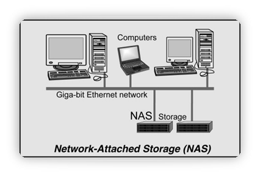
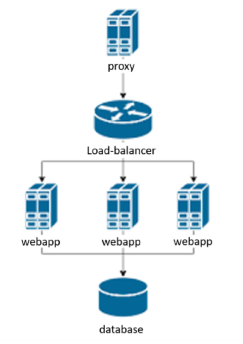
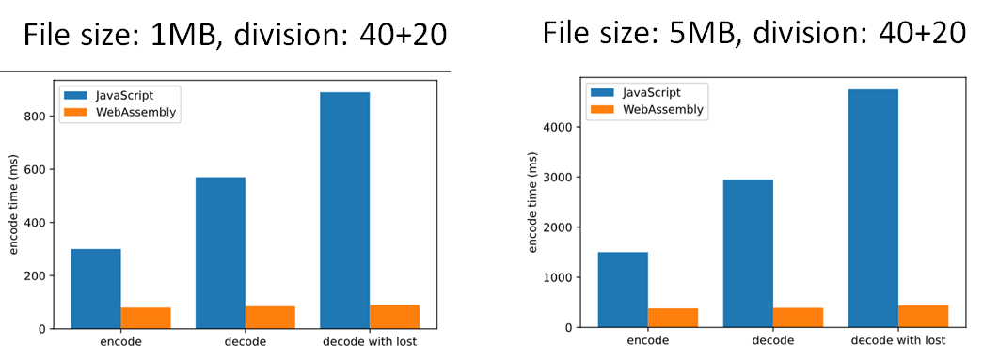
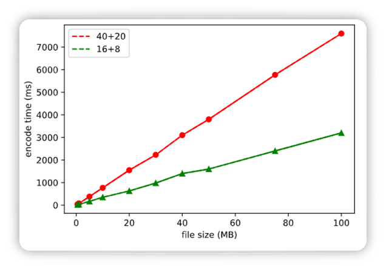
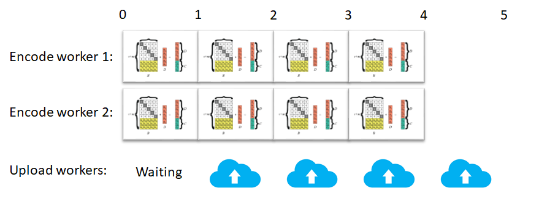
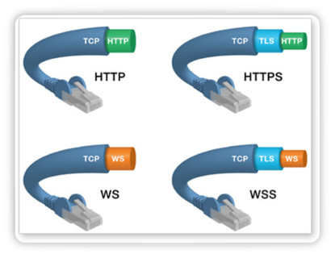
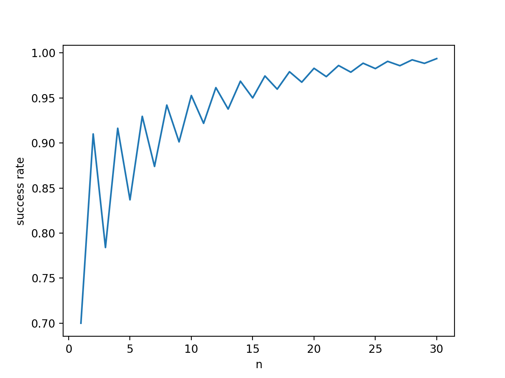

# 结题报告

在 GitHub 阅读本报告的 markdown 格式文档（[conclusion.md](https://github.com/OSH-2020/x-dontpanic/blob/master/docs/conclusion.md)）时，推荐安装 [MathJax Plugin for Github](https://chrome.google.com/webstore/detail/ioemnmodlmafdkllaclgeombjnmnbima) 插件。

- [结题报告](#结题报告)
  - [项目介绍](#项目介绍)
  - [立项依据](#立项依据)
    - [项目背景](#项目背景)
    - [相关项目](#相关项目)
      - [IPFS](#ipfs)
      - [NAS](#nas)
      - [前人工作](#前人工作)
      - [小结](#小结)
  - [项目设计](#项目设计)
    - [项目结构](#项目结构)
    - [Docker 容器化服务端](#docker-容器化服务端)
      - [为什么要使用容器化技术](#为什么要使用容器化技术)
      - [Docker-Compose](#docker-compose)
    - [前端美化](#前端美化)
    - [文件编解码](#文件编解码)
      - [稳定性](#稳定性)
      - [开源纠删码项目](#开源纠删码项目)
      - [WebAssembly 与 JavaScript 效率对比](#webassembly-与-javascript-效率对比)
      - [浏览器端实现文件编解码](#浏览器端实现文件编解码)
        - [使用 FileReader 获取本地文件](#使用-filereader-获取本地文件)
        - [Go-WebAssembly：使用 syscall/js 包编写源代码](#go-webassembly使用-syscalljs-包编写源代码)
        - [callEncoder：接收原始数据并调用 Go 函数编码](#callencoder接收原始数据并调用-go-函数编码)
        - [callMD5：为碎片生成 MD5 摘要](#callmd5为碎片生成-md5-摘要)
        - [callDecoder：接收碎片并调用 Go 函数解码](#calldecoder接收碎片并调用-go-函数解码)
      - [Go-WebAssembly 编码性能](#go-webassembly-编码性能)
    - [WebSocket](#websocket)
      - [实现 WebSocket API](#实现-websocket-api)
        - [握手](#握手)
        - [解析/产生帧](#解析产生帧)
    - [碎片分配策略](#碎片分配策略)
    - [多用户权限支持](#多用户权限支持)
      - [前置项目关于用户权限的设计](#前置项目关于用户权限的设计)
        - [数据库配置](#数据库配置)
      - [改进用到的技术](#改进用到的技术)
        - [新的数据库设计](#新的数据库设计)
        - [新的 Web 端设计](#新的-web-端设计)
  - [前景展望](#前景展望)
  - [思考](#思考)
    - [重新加入中心节点](#重新加入中心节点)
    - [更高性能的纠删码模块设计](#更高性能的纠删码模块设计)
  - [项目总结](#项目总结)
  - [组员总结](#组员总结)
  - [致谢](#致谢)
  - [参考文献](#参考文献)

## 项目介绍

本项目旨在实现可用性高的基于互联网网页的小型分布式文件系统。为了减少不必要的重复劳动，本项目基于[往届 OSH 项目](https://github.com/IngramWang/DFS_OSH2017_USTC)进行优化。在已有的项目的基础上，实现容器化服务器端、多用户权限支持、更高效的文件传输、减轻中央服务器负担、提高文件安全性和可用性等优化。一方面可以用作易于部署、可用性高的“私人网盘”，另一方面也为用户群的扩展和服务推广留出了上升空间，提供了替代商业云存储的选择。

## 立项依据

### 项目背景

随着社会经济的发展与信息化的进行，台式计算机、膝上电脑、智能手机、平板电脑和更多的智能可穿戴设备正疯狂涌入当前的家庭和小微企业。这些设备极大地提高了企业的办公效率、丰富了家庭的娱乐需求，但如何高效地利用分散在这些不同的设备上的存储空间如今正越发成为大家关注的问题：运用好这些分散的存储空间不仅可以方便多人合作，更可以避免资源的浪费。

而家庭和小微企业的存储设备有如下特点：

- 存储资源小而分散，每个设备的存储容量通常不超过 1 TB；
- 设备通常只有在使用时才会在线联网，否则处于关闭状态；
- 很多设备的位置随时间而变化，故它们常常并不总在其归属网络上；
- 和专用的服务器相比，这些设备的性能较低；
- 设备没有统一的指令集和操作系统；
- 连接设备的网络环境较差，往往通过一般的局域网或互联网相连接。

面对这些特点，很难用一个集中式的文件系统组织分散在这些不同的设备上的存储空间。

然而，即使是传统的分布式文件系统想在这种环境中应用也是十分困难的，这体现在：

- 传统的分布式文件系统往往要求高性能、稳定的服务器，而上述环境中的机器不但性能不足，更不常在线；
- 传统的分布式文件系统往往要求服务器具有相同的操作系统甚至是定制的操作系统以方便管理，而上述环境中的机器运行不同的操作系统上；

同时，各大商业网盘的安全性深受质疑，限速或者收费等限制并不能很好地满足我们对存储的需要。

总而言之：

1. 个人/家庭有使用分布式存储提高数据安全性的需求，同时有分散在若干个人设备的碎片化存储资源可以利用。
2. 传统的分布式文件系统并不适用于小型私有云场景。
3. 各种个人搭建私有云的方案可移植性较差，且部署需要较多配置。

面对前述现状，我们希望在前人的试验基础上，实现可用性更高的、可移植性更强的、基于互联网的小型分布式文件系统，在上述应用环境中提供良好的私人部署网盘服务。

### 相关项目

在调研阶段中，小组成员对许多相关项目进行了调研，在项目中寻找可创新之处并获得了许多灵感。以下是两类典型的系统。

#### IPFS

IPFS 全称 Interplanetary File System，意为星际文件系统。它创建了分布式存储和共享文件的网络传输协议，意在将所有具有相同文件系统的计算设备连接在一起。IPFS 有如下特性：

1. 使用区块链技术，使 IPFS 实现了文件存储的持久性，相比中心化的服务更难被篡改和封禁。
2. IPFS 在文件传输上采取 P2P 模式， 充分地利用了个节点之间的带宽资源，并且无需一个强大的中央服务器来满足大量服务，达到了高效和低成本。
3. 每一个上传到 IPFS 的文件会被分配一个内容的哈希作为地址，访问只需验证哈希。
4. Filecoin 是 IPFS上的一个代币，用来激励用户贡献闲置的硬盘。它通过算法确定工作量发放。简单来说，拥有的硬盘容量越大，获取的 Filecoin 越多。

#### NAS



NAS 全称 Network Attached Storage，是一种可以通过网络访问的专用数据存储服务器，它可以将分布、独立的数据进行整合，集中化管理，以便于对不同主机和应用服务器进行访问的技术。

在实际应用中，NAS 可以用于更好地管理家庭数据。例如家中的各种电脑，平板，手机等设备，可以通过 NAS 统一存储数据和同步数据。

#### 前人工作

我们参考了 2017 年 OSH 课程的大作业项目之一：[基于互联网的分布式文件系统](https://github.com/IngramWang/DFS_OSH2017_USTC)。但是该项目的数据传输是中心化的，所有文件都要经过中央服务器的中转，有很多不利的地方。

我们从这个项目中借鉴了部分设计思路，例如使用 Java 编写客户端以便于跨平台部署存储节点，提供 web 文件管理界面，以及使用纠删码做冗余。同时我们也吸取了一些经验教训，例如该项目中服务器的配置比较繁杂，我们则在项目中采用 docker 进行了封装简化配置。

#### 小结

|            | IPFS                               | Our FS                                         |
| ---------- | ---------------------------------- | ---------------------------------------------- |
| 数据安全性 | 无身份验证，拿到哈希值就能拿到文件 | 目录节点可进行身份验证，用户只能访问自己的文件 |
| 数据可靠性 | 无法保证足够可用源                 | 目录节点可协调冗余备份，保证备份充足           |

在前述两种典型系统中，IPFS 本身在去中心化上做的很充分，同时因为完全去除了中心化的元素，它仍然有需要解决的问题：

- 存储数据的安全性：没有验证用户身份的过程，任何人只要拿到文件的哈希值就能拿到文件。
- 数据可靠性：IPFS 系统虽然有激励层，但是无法保证一份数据能够有**足够的备份**在系统中存储，从而有可能导致数据丢失。

我们的项目不仅有 IPFS 的存储节点去中心化的优势，还能避免其两大问题，这都得益于设计中的目录节点。我们之后会详细介绍。

|          | NAS                            | Our FS                             |
| -------- | ------------------------------ | ---------------------------------- |
| 设备限制 | 专有设备                       | 普通设备运行客户端即可，跨平台兼容 |
| 扩容限制 | 单台扩容有限，多台难以无缝合并 | 无缝扩展                           |

至于 NAS 的局限性在于它的系统使用专有设备，前期安装和设备成本较高。同时 NAS 在可扩展性上也有一定的限制，因为单台 NAS 的扩容是有限的，增加另一台 NAS 设备非常容易，但是要想将两个 NAS 设备的存储空间**无缝合并**就不容易了。 

而在本项目中，存储节点只需要持续运行本项目的 Java 跨平台程序，不需使用专有设备，并且项目在可扩展性上不存在 NAS 面临的问题。

## 项目设计

### 项目结构


我们的项目从 IPFS 中吸取了 P2P 的思想，在数据传输上实现了点对点传输。

文件系统由一个目录节点（index）和若干存储节点（storage）组成。目录节点负责提供 web 管理界面，以及协调各存储节点的资源。这样的数据存储和传输方式能够有效节约带宽资源，避免传统 server/client 模式中中央服务器负载过重产生的瓶颈。如我们参考的往届大作业项目中，便存在中央服务器数据传输瓶颈的问题。同时，传输的文件内容也不会经过目录节点，使用者不必担心权力集中和监管的弊端。

由于项目设计中目录节点的存在，我们能够对访问者进行身份验证，对数据的冗余备份进行协调，从而避免 IPFS 中的安全性问题和可靠性问题。

相对于扩展性较差的 NAS，本项目各节点之间的连接基于互联网，这非常有利于存储节点的接入和用户群的扩展。如有更多的用户参与成为存储节点，则会进一步提高系统的稳定性和可用性。


为了提高本项目的易用性，我们将目录节点运行的服务用 docker 容器进行封装，一方面解决了适配不同环境的问题，提高了兼容性，另一方面也使一键部署成为可能。存储设备只需运行我们的 Java 程序，便可以作为存储节点接入分布式文件系统。而因为 JVM 虚拟机的跨平台兼容特性，凡是能运行 Java 的设备都能成为本项目的存储节点，即无论使用 Windows、Mac OS、Linux 操作系统均可兼容。这意味着使用者可以比较方便地将任意闲置资源贡献为存储结点。这或将高度提升未来私人部署网盘的占有率，更能避免对商业云存储的依赖。

同样出于提升易用性的考虑，我们提供 web 界面进行文件管理操作，一方面避免安装客户端的麻烦，另一方面也利用了 web 的跨平台兼容性。

这样一来，从部署目录节点、接入存储节点到管理文件，整个系统操作都相当便捷，非常有利于用户自行部署搭建服务。

### Docker 容器化服务端

#### 为什么要使用容器化技术

在生产环境上，传统的手工部署方法可能会出现下列事件：

- 你的 Linux 发行版很老，而你需要运行一个给新版本的 Linux 或者完全不同的 Linux 发行版设计的程序。
- 你和朋友一起设计一个大型程序，由于你们的运行环境不同，有时候在某台机器上正常运行的程序，在另一台机器上没法正常运行。
- 你希望在多台服务器上部署同一个项目，但是项目需要非常复杂的配置，一个一个配置服务器的成本非常大。

而容器化技术可以方便解决上述问题，容器可以把应用及其依赖项都将打包成一个可以复用的镜像并与其他进程环境隔离。

在运行环境、网络拓扑、安全策略和存储方案变化时，软件可能会显现一些出乎意料的问题；而容器使开发环境和运行环境统一。同时容器并不像虚拟机那样模拟全部硬件（这对于很多轻量型应用是小题大做），它只虚拟化了文件系统、网络、运行环境等，在核心本地运行指令，不需要任何专门的接口翻译和系统调用替换机制，减少了很多虚拟化开销。

使用容器技术很好地简化了目录节点的配置，同时还可以减少开发环境和部署环境不同带来的问题。

很多时候人们可能因为配置文档过于复杂或者因为环境问题配置失败，就放弃了一个项目。提供一键部署的方案，降低了部署的成本和学习门槛，非常有利于项目的推广。

#### Docker-Compose

Docker-Compose 是 Docker 官方用于定义和运行多容器的编排工具。

在我们的项目中，Docker-Compose 提高了项目的易用性，使用者可以轻松地部署目录节点。

Docker-Compose 的 scale 功能还支持创建多个实例进行负载均衡反向代理。这可以在我们想进行用户群的扩展时，轻松解决目录节点高并发的问题，并把处理能力分布在多台主机上。



本项目中，下面这段 docker-compose.yml 描述了 mytomcat、mymysql 和 myserver 这三个 Docker 容器的镜像、端口、依赖等信息。

```yaml
version: '2'
services:
  mytomcat:
    image: tomcat:7
    hostname: mytomcat
    container_name: mytomcat
    restart: always
    ports:
      - "8080:8080"
    depends_on:
      - mymysql
    links:
      - mymysql
    environment:
      - Xmn384m
      - XX:MaxPermSize=128m
      - XX:+UseConcMarkSweepGC
      - XX:+DisableExplicitGC
      - XX:+UseParNewGC
    volumes:
      - "$PWD/WebContent:/usr/local/tomcat/webapps"
  mymysql:
    build: ./mysqlinit
    image: mymysql:test
    container_name: mymysql
    restart: always
    ports:
      - "3306:3306"
    command: [
      '--default-authentication-plugin=mysql_native_password',
      '--character-set-server=utf8mb4',
      '--collation-server=utf8mb4_general_ci'
    ]
    environment:
      MYSQL_ROOT_PASSWORD: 201314
      MYSQL_USER: 'root'
      MYSQL_PASS: '201314'
      serverTimezone: Asia/Shanghai
    volumes:
      - "$PWD/mysqldata:/var/lib/mysql"
  myserver:
    build: ./myserver
    image: myserver:test
    container_name: myserver
    restart: always
    depends_on:
      - mymysql
    links:
      - mymysql
    volumes:
      - "$PWD/WebContent:/usr/local/tomcat/webapps"
    ports:
      - "2333:2333"
```

### 前端美化

项目的前端 UI 完全采用 layui 的实现，在用户使用时表现整洁但又不简陋。

### 文件编解码

#### 稳定性

我们的项目采用纠删码技术中的里德-所罗门算法（Reed-Solomon Code）对文件进行冗余，并使用性能相比于范德蒙矩阵更好的柯西矩阵作为编码矩阵，这部分内容的详细介绍在[可行性报告](https://github.com/OSH-2020/x-dontpanic/blob/master/docs/feasibility.md)中有比较详细的介绍。下面我们做个简单的计算，将纠删码和简单副本备份进行对比。

假设采用副本备份的数量为 k，单个存储节点的故障率为 p。使用副本冗余时的丢失概率为 p^k，即 k 份副本全部丢失的概率。采用纠删码时我们会将文件分为 n 块原始数据块，并冗余 m 块校验块，且 n+m 块分给不同的节点。纠删码的丢失概率可以用以下式子计算出，即丢失碎片数量大于 m 块的概率：

- 设单个存储节点故障率为 p，使用纠删码时文件分成 n 块并冗余 m 块，n + m 块分给不同的存储节点。而副本备份冗余数量为 k，分别放在不同节点。

- 单点存储丢失概率：p

- 副本冗余丢失概率：p^k

- 纠删码冗余丢失概率：$\sum_{i=m+1}^{n+m}{n+m\choose i}p^i(1-p)^{n+m-i}$

- 设 p = 1%，n = 5，m = 5

- 纠删码冗余存储丢失概率：2.03e-10

- 达到同样概率所需备份数量：5

- 纠删码节约空间：file size*3

上面的计算中代入数据，可以看到在故障率为 1%，文件分 5 块并冗余 5 块条件下，纠删码的故障率仅有 2e-10 左右，有效保障了数据安全不易丢失。而靠副本冗余想达到同样的效果，需要 5 份备份。

在上述条件下，纠删码技术在同等丢失率条件下比副本备份节约了 3 倍于文件大小的空间，有力地说明了纠删码还能够大幅减少冗余所需的额外空间开销。

#### 开源纠删码项目

纠删码本身目前已经是一种比较成熟的算法，而其中的 Reed-Solomon 算法提出时间比较早并且已经有开源实现，相对引入系统的难度较低。此外，为了在浏览器端实现文件编解码以减少服务器的工作量，我们希望应用 WebAssembly 编译现有的开源算法。

在本项目中，我们分别尝试了用 JavaScript 和 WebAssembly 在浏览器上做纠删码。其中 JavaScript 直接基于[开源的实现](https://github.com/ianopolous/ErasureCodes)进行了一些修改。

数据储存服务供应商 Backblaze 在 GitHub 开源提供了一个使用 Java 编写的 Reed-Solomon 库。以此为基础实现了许多其他语言如 Go、Python 编写的 RS 纠删码项目，其中 [Go 语言的实现](https://github.com/klauspost/reedsolomon)有较多的 Star 量，内容也较为完善。为了在网页中应用项目中的函数，我们利用它编写了 Go 语言代码并编译成 WebAssembly 格式。

#### WebAssembly 与 JavaScript 效率对比

在项目 demo 完成后，我们对 WebAssembly 和 JavaScript 代码的效率进行测试得到了两组对比的 benchmark，两组对文件大小的参数进行了更改。可以看到在 WebAssembly 上实现的纠删码效率远远高于 JavaScript，编码速率提升将近 4 倍，而解码提升了 7 倍左右。在有一块文件块缺失的条件下，WebAssembly 的解码效率提升了 10 倍。



#### 浏览器端实现文件编解码

##### 使用 FileReader 获取本地文件

通过使用在 HTML5 中加入到 DOM 的 File API，用户可以在 web 内容中选择本地文件然后读取这些文件的内容。FileReader 对象允许Web 应用程序异步读取存储在用户计算机上的文件（或原始数据缓冲区）的内容，使用 File 或 Blob 对象指定要读取的文件或数据。

我们成功读取文件后，记录它的文件名、大小、设置的分块数等信息，另外需要将其转换为 Uint8Array 格式，这是因为在 Go 接收 JavaScript 传递的数据时，需要通过 CopyBytesToGo 方法拷贝数据到 Go 的对象中，这个方法要求传递 Uint8Array 类型的数据。在 JavaScript 版本的代码中，也要将原始文件内容转换为 Uint8Array 编码。

之后，我们创建 Worker 线程，在其中调用 JavaScript 或者由 Go-WebAssembly 导出的函数进行文件编码，并生成碎片的 MD5 摘要。

##### Go-WebAssembly：使用 syscall/js 包编写源代码

Go 提供了专有 API syscall/js 包，使我们可以与 JavaScript 之间传递函数与数据。来源于 JavaScript 的数据在 Go 中会是 js.Value 类型，需要使用包里的函数进行转换。除了通过上一节提到的 CopyBytesToGo 方法拷贝 JavaScript 数据到 Go 的对象中，我们还会用到 CopyBytesToJS 将运算结果返回给 JavaScript，以及 FuncOf 用于包装 Go 函数，等等。

在 Go 代码中，我们接收 Uint8Array 类型数据，并提供三个函数给 JavaScript 使用：

- callEncoder 用于编码；
- callDecoder 用于解码；
- callMd5 用于计算碎片的 MD5 值，从而在解码时判断碎片内容是否发生了改变。

这三个函数将会完成数据类型的转换和 Go 函数的调用。在 main() 函数中声明这些函数，并阻止 Go 程序退出。

```go
func main() {
    c := make(chan struct{}, 0)
    js.Global().Set("callMd5",js.FuncOf(callMd5))
    js.Global().Set("callEncoder",js.FuncOf(callEncoder))
    js.Global().Set("callDecoder",js.FuncOf(callDecoder))
    <-c
}
```

接下来分别简述 Go-WebAssembly 的三个函数。

##### callEncoder：接收原始数据并调用 Go 函数编码

为了能将 Go 函数传递给 JavaScript 使用，Go 函数的参数和返回值类型在[js 包文档](https://golang.org/pkg/syscall/js/#FuncOf)中有固定格式的要求。

```go
func FuncOf(fn func(this Value, args []Value) interface{}) Func
```

这意味着 JavaScript 和 Go 的数据需要经过一些转换。callEncoder 函数声明为：

```go
func callEncoder(this js.Value, args []js.Value) interface{}
```

而在 JavaScript 代码中调用 callEncoder 函数时，我们接收 JavaScript 中 Uint8Array 类型的原始文件数据，以及进行纠删码编码需要的原始数据块、冗余块两个参数，并传递给 goEncoder 以调用 Go 开源库的函数。

```go
buffer := make([]byte, args[0].Length())
js.CopyBytesToGo(buffer, args[0])
content := goEncoder(buffer, args[1].Int(), args[2].Int())
```

得到编码后的数组（content）后，再调用 CopyBytesToJS 函数转换成 js.Value 类型，于是函数的返回值能在 JavaScript 代码中直接使用。

```go
jsContent := make([]interface{},len(content))
for i:=0; i<len(content); i++{
    jsContent[i] = js.Global().Get("Uint8Array").New(len(content[0]))
    js.CopyBytesToJS(jsContent[i].(js.Value),content[i])
}
return js.ValueOf(jsContent)
```

在 goEncoder 函数中，我们可以直接使用[开源库](https://github.com/klauspost/reedsolomon)中的函数进行编码。为了在生成编码矩阵时使用性能上更好的柯西矩阵，参照[说明文档](https://pkg.go.dev/github.com/klauspost/reedsolomon?tab=doc#WithAutoGoroutines)加入 WithCauchyMatrix() 参数。编码得到的结果返回给 callEncoder 函数进行格式转换。

```go
func goEncoder(raw []byte, numOfDivision int, numOfAppend int)(content [][]byte){
    enc, err := reedsolomon.New(numOfDivision, numOfAppend, reedsolomon.WithCauchyMatrix())
    checkErr(err)
    content, err = enc.Split(raw)
    checkErr(err)
    err = enc.Encode(content)
    checkErr(err)
    return content
}
```

##### callMD5：为碎片生成 MD5 摘要

碎片的摘要可以用于检验碎片内容是否发生变化，从而在解码时忽略已经损坏的碎片。通过比较本地文件和云端文件的摘要也可以实现文件秒传功能，在我们的项目中还没有实现。

MD5 是一种被广泛使用的摘要算法，使用它可以为每个碎片产生一个128位（16字节）的哈希值。Go 的 crypto/md5 包提供了md5.Sum() 函数来进行这个运算。

在 callMD5 函数中，我们调用计算 MD5 的函数，并用 fmt.Sprintf() 函数将字符类型的运算结果直接返回给 JavaScript。

这一部分的代码思路借鉴了[使用Go开发前端应用（三）](https://juejin.im/post/5eb2191df265da7bbf21a0f4)。

```go
func callMd5(this js.Value, args []js.Value) interface{} {
    // 声明一个和文件大小一样的切片
    buffer := make([]byte, args[0].Length())
    // 将文件的bytes数据复制到切片中，这里传进来的是一个Uint8Array类型
    js.CopyBytesToGo(buffer, args[0])
    // 计算md5的值
    res := md5.Sum(buffer)
    // 调用js端的方法，将字符串返回给js端
    return fmt.Sprintf("%x", res)
}
```

##### callDecoder：接收碎片并调用 Go 函数解码

如果碎片的摘要发生变化，说明碎片可能损坏，在解码时应当认为碎片丢失。在 callDecoder 函数中，接收到的参数是 JavaScript 代码中由文件碎片组成的二维数组，其中我们会将摘要值不符合记录的碎片设为 null。

对于每一块碎片（在 Go 代码中它可以表示为 args[0].Index(i)）我们判断它是否为空，并转换成 Go 中的类型，然后进行解码。

```go
buffer := make([][]byte, args[0].Length())
for i:=0; i<len(buffer); i++ {
    // if args[0][i]==null, set buffer[i] as nil.
    if !args[0].Index(i).Equal(js.Null()) {
        buffer[i] = make([]byte, args[0].Index(i).Length())
        js.CopyBytesToGo(buffer[i], args[0].Index(i))
    }else {
        buffer[i]=nil;
    }
}
content := goDecoder(buffer, args[1].Int(), args[2].Int())
```

解码完成后，再进行类型转换返回给 JavaScript。

#### Go-WebAssembly 编码性能



这张图是两组不同的纠删码参数下，编码时间随文件大小的变化。可以看到两组都呈现编码时间随文件大小线性增长。在 40 + 20 这一组中，平均每 1MB 的文件需要消耗约 76ms 来编码，16 + 8 的时候是 33ms/MB。或者换一个角度看，编码的吞吐速率分别为大约 13MB 每秒和 30MB 每秒。这样的吞吐量已经相当不错了，与千兆网带宽在一个数量级上。

对于很大的文件，可以把文件先分成小块再逐一做纠删码。同时，分块还可以有其他好处。例如可以用不止一个 worker 并行地做纠删码，从而进一步缩短工作时间。

在此之上还能追加流水作业。如下图，负责编码的 worker 将编码完成的数据块交给上传的 worker 发送，他们的吞吐速率大致相同，形成流水线作业。采用这样的方式，可以完全将编码带来的时间开销隐藏在传输时间当中，使系统具有非常快的上传下载速度，从而实现高效性。



这里的[表格](https://github.com/fabfish/ErasureCodeforBrowserSide/blob/master/benchmark.ods)记录了在虚拟机中测得的浏览器端运行纠删码的一些效率数据。

### WebSocket



JavaScript 没有可以直接使用的 TCP 接口。为了在浏览器和存储节点之间直接传输数据，我们选择了 WebSocket 协议来实现浏览器和客户端的直连。WebSocket 是一种网络通信协议，选择它有如下好处：

1. 建立在 TCP 协议之上，本项目中存储节点客户端上的实现比较容易。

1. 与 HTTP 协议有着良好的兼容性。默认端口也是 80 和 443，并且握手阶段采用 HTTP 协议，因此握手时不容易屏蔽，能通过各种 HTTP 代理服务器。

1. 数据格式比较轻量，性能开销小，通信高效，适合本项目中传输文件的用途。

1. 可以发送文本，也可以发送二进制数据。

1. 没有同源限制，浏览器可以与任意服务器通信，即可以与任意存储节点通信。

#### 实现 WebSocket API

现代主流浏览器均支持 WebSocket，js 带有原生 WebSocket 客户端 API，因此只需要实现用于存储节点的 WebSocket 服务端 API。

浏览器 js 直接使用 WebSocket（以 download 为例）：

```javascript
function WebSocketDownload(ip,port,fragmentName,content,digest,fragmentId)
{
    var ret_bytes;
    var ret_digest;
    if ("WebSocket" in window)
    {
        let ws = new WebSocket("ws://"+ip+":"+port);
        ws.binaryType="arraybuffer";
        ws.onopen = function()
        {
            ws.send("D");
            ws.send(fragmentName);
        };

        ws.onmessage = function (evt)
        {
            let received_data = evt.data;
            if(evt.data instanceof ArrayBuffer ){
                ret_bytes= received_data;
            }
            if(typeof(evt.data) =='string') {
                ret_digest= received_data;
            }
        };

        ws.onclose = function()
        {
            content[fragmentId]=ret_bytes;
            digest[fragmentId]=ret_digest;
            console.log('closed connection');
        };
    }
    else
    {
        alert("Your browser doesn't support WebSocket!")
    }
}
```

我们根据相关文档实现了服务端  API，获得了在浏览器端和存储节点之间直接建立数据连接的通信方式。

##### 握手

根据，首先需要使用 HTTP 协议进行握手。

浏览器会发送如下 request，其中 `Sec-WebSocket-Key` 的值仅为实例，并非固定值。

```http
GET /chat HTTP/1.1
Host: example.com:8000
Upgrade: websocket
Connection: Upgrade
Sec-WebSocket-Key: dGhlIHNhbXBsZSBub25jZQ==
Sec-WebSocket-Version: 13
```

服务端需要发送如下 response，其中，`Sec-WebSocket-Accept` 是将 `Sec-WebSocket-Key` 加上 `258EAFA5-E914-47DA-95CA-C5AB0DC85B11`（这是个 magic string） 然后取 SHA-1 得到的。

```http
HTTP/1.1 101 Switching Protocols
Upgrade: websocket
Connection: Upgrade
Sec-WebSocket-Accept: s3pPLMBiTxaQ9kYGzzhZRbK+xOo=
```

##### 解析/产生帧

WebSocket 使用了自定义的二进制分帧格式，把每个应用消息切分成一或多个帧，发送到目的地之后再组装起来，等到接收到完整的消息后再通知接收端。

帧格式：

```text
0                   1                   2                   3
0 1 2 3 4 5 6 7 8 9 0 1 2 3 4 5 6 7 8 9 0 1 2 3 4 5 6 7 8 9 0 1
+-+-+-+-+-------+-+-------------+-------------------------------+
|F|R|R|R| opcode|M| Payload len |    Extended payload length    |
|I|S|S|S|  (4)  |A|     (7)     |             (16/64)           |
|N|V|V|V|       |S|             |   (if payload len==126/127)   |
| |1|2|3|       |K|             |                               |
+-+-+-+-+-------+-+-------------+ - - - - - - - - - - - - - - - +
|     Extended payload length continued, if payload len == 127  |
+ - - - - - - - - - - - - - - - +-------------------------------+
|                               |Masking-key, if MASK set to 1  |
+-------------------------------+-------------------------------+
| Masking-key (continued)       |          Payload Data         |
+-------------------------------- - - - - - - - - - - - - - - - +
:                     Payload Data continued ...                :
+ - - - - - - - - - - - - - - - - - - - - - - - - - - - - - - - +
|                     Payload Data continued ...                |
+---------------------------------------------------------------+
```

具体解释如下：

- FIN：1 bit，表示此帧是否是消息的最后帧。
- RSV1，RSV2，RSV3：各 1 bit。保留位，必须是0。
- opcode：4 bit。表示被传输帧的类型：x0 表示一个后续帧；x1 表示一个文本帧；x2 表示一个二进制帧；x3-7 为以后的非控制帧保留；x8 表示一个连接关闭；x9 表示一个ping；xA 表示一个pong；xB-F 为以后的控制帧保留。
- Mask：1 bit。表示 payload 是否有掩码（客户端发送给服务器为 1，服务器发送给客户端为 0，具体原因此处不赘述）。
- Payload length： 7 bit, 7 + 16 bit, 7 + 64 bit。 payload 长度由可变长度字段表示： 如果是 0~125，就是 payload 长度；如果是 126，则接下来 2 字节表示的 16 位无符号整数是这一帧的长度； 如果是 127，则接下来 8 字节表示的 64 位无符号整数是这一帧的长度。
- Masking-key：根据 Mask 的取值为 0 或 4 Byte。如果有掩码，真实的数据为 payload 逐 4 字节和 Masking-key 做异或操作。

是否把消息分帧由客户端和服务器实现决定，应用并不需要关注 WebSocket 帧和如何分帧，因为客户端和服务端将会完成该工作。RFC 6455 规定了分帧规则，要点如下：

- 一个未分帧的消息包含单个帧，FIN 设置为 1，opcode 非 0。
- 一个分帧了的消息包含：开始于：单个帧，FIN 设为 0，opcode 非 0；后接 ：0 个或多个帧，FIN 设为 0，opcode 设为 0；终结于：单个帧，FIN 设为 1，opcode 设为 0。一个分帧了消息在概念上等价于一个未分帧的大消息，它的有效载荷长度等于所有帧的有效载荷长度的累加；举例：如一个文本消息作为三个帧发送，第一帧的 opcode 是 0x1，FIN 是 0，第二帧的 opcode 是 0x0，FIN 是 0，第三帧的 opcode 是 0x0，FIN 是 1。

我们的服务器端 API 按照上述规则实现。为保持简洁，此处不陈列相关代码。

### 碎片分配策略

考虑到接入系统的存储节点可以是个人设备，不一定能24小时全天在线。为了保证下载文件的成功率，我们需要一个合理的碎片分配策略。策略中只需要考虑设备和用户在线时间重合度，就可以大幅提高成功下载的概率。

我们将一个设备或者一个用户一天中的在线时间表示成一个长度为 24 的 0/1 向量，在上传文件时尽可能地给覆盖上传者的在线时间段 x% 以上的存储结点分配碎片。这里的 x% 的含义是：在 24 个时间段内，有 x% 以上的时间段不会发生用户在线而设备不在线的情况。

我们的分配策略还估计到了剩余容量，碎片不会再分给剩余容量到达上限的节点，避免分配出现严重的倾斜。

相关代码如下：

```java
private DeviceItem[] getAllocateDeviceList(Query query,int nod,int noa, String whose){
    // 确认有在线设备
    DeviceItem[] onlineDevice = query.queryOnlineDevice();
    if(onlineDevice == null){
        return null;
    }
    // 计算相似度 0<=distance<=24
    int onlineDeviceNum = onlineDevice.length;
    int[] distance = new int[onlineDeviceNum];
    for(int i=0; i<onlineDeviceNum; i++){
        int save = query.queryUserTime(whose);
        int time = onlineDevice[i].getTime();
        distance[i] = 0;
        for(int j=0; j<24; j++){ // 24维
            if((time & 1) == 0 & (save & 1) == 1)
                distance[i]++;
            time = time >> 1;
            save = save >> 1;
        }
    }

    int fragmentSize = fileSize/nod;
    // 由于有 vlab，必然有至少一台distance <= 30% * 24 = 7
    ArrayList<Integer> distanceId = new ArrayList<>();
    for(int i=0; i<onlineDeviceNum; i++){
        if(distance[i]<=7 & onlineDevice[i].getLeftrs() > fragmentSize)
            // 差距够小 且 至少可以分配一个碎片
            distanceId.add(0, i); // 一直从头插入
    }
    int size = distanceId.size(); // 有效在线主机数
    if(size < 1)
        return null;
    // 根据碎片数量和有效在线主机数，确定结果
    DeviceItem[] deviceItemList=new DeviceItem[nod+noa];
    if(noa+nod <= size){
        for(int i=0;i<nod+noa;i++){
            deviceItemList[i] = onlineDevice[distanceId.get(i)];
            deviceItemList[i].setLeftrs(deviceItemList[i].getLeftrs() - fragmentSize);
        }
    }
    else{ // noa+nod > size
        int i = noa+nod-1;
        int j = 0;
        while(i>=0){
            DeviceItem thisdevice = onlineDevice[distanceId.get(j)];
            if(thisdevice.getLeftrs() > fragmentSize){
                deviceItemList[i] = thisdevice;
                thisdevice.setLeftrs(thisdevice.getLeftrs() - fragmentSize);
                query.alterDevice(thisdevice);
                i--;
            }
            j = (j+1)%size;
        }
    }
    return deviceItemList;
}
```

接下来，通过数学公式和计算图表来展示分配策略的效果。

我们设上传文件是在线存储节点数目为 n，文件分为 nod（numOfDivision） 块碎片，冗余 noa（numOfAppend）块碎片，在线率为 p，则取得完整文件的成功率表达式如下：

$$
\sum_{i= \left \lceil n\times nod{\div} \left ( nod+noa \right )  \right \rceil }^{n} \binom{n}{i}\times p^{i}\times (1-p)^{n-i}
$$

假设每一个拿到碎片的设备在线率都为 p = 70%，设备为 n 台，取纠删码分 nod = 4 块碎片，冗余 noa = 4 块碎片的参数，代入图中公式，随着 n 的增大得到接近 100% 的成功率。



同时，我们还可以加入一些保证 24h 在线的可靠节点（例如商业云等稳定的云服务）作为一个单独的分类，此时分配策略可以固定向可靠节点分一定比例的碎片，那么那些碎片的在线率可以视为 100%，进一步提高下载成功概率。

### 多用户权限支持

#### 前置项目关于用户权限的设计

##### 数据库配置

服务器数据库模块负责分布式文件系统的数据库访问，包括封装了数据库访问方法的 Query 类与用于定义数据结构的 FileItem、DeviceItem、RequestItem 类。

本分布式文件系统使用数据库维护所有的元数据，数据库中具体包括表 FILE 用于存储文件的逻辑位置与属性、表 FRAGMENT 用于存储碎片的物理位置、表 REQUEST 用于存储服务器对客户端的碎片请求、表 DEVICE 用于存储系统中客户端的信息、表 USER 用于存储网页的注册用户。

```sql
CREATE TABLE `DEVICE` (
`ID` int NOT NULL AUTO_INCREMENT,
`IP` char(20) NOT NULL DEFAULT '',
`PORT` int NOT NULL DEFAULT 0,
`ISONLINE` boolean NOT NULL,
`RS` int NULL DEFAULT 0 ,
PRIMARY KEY (`ID`)
) ENGINE=InnoDB DEFAULT CHARSET=utf8;

CREATE TABLE `FRAGMENT` (
`ID` int NOT NULL,
`PATH` char(20) NOT NULL DEFAULT '',
PRIMARY KEY (`ID`)
) ENGINE=InnoDB DEFAULT CHARSET=utf8;

CREATE TABLE `FILE` (
`ID` int NOT NULL AUTO_INCREMENT,
`NAME` char(20) NOT NULL DEFAULT '',
`PATH` char(60) NOT NULL DEFAULT '',
`ATTRIBUTE` char(10) NOT NULL DEFAULT '',
`TIME` char(10) NOT NULL DEFAULT '',
`NOA` int NOT NULL DEFAULT 1,
`ISFOLDER` boolean NOT NULL DEFAULT false,
PRIMARY KEY (`id`)
) ENGINE=InnoDB DEFAULT CHARSET=utf8;

CREATE TABLE `REQUEST` (
`ID` int NOT NULL AUTO_INCREMENT,
`TYPE` int NOT NULL DEFAULT 0,
`FRAGMENTID` int NOT NULL DEFAULT 0,
`DEVICEID` int NOT NULL DEFAULT 0,
PRIMARY KEY (`ID`)
) ENGINE=InnoDB DEFAULT CHARSET=utf8;

CREATE TABLE `USER` (
`ID` int NOT NULL AUTO_INCREMENT,
`NAME` char(20) NOT NULL UNIQUE DEFAULT '',
`PASSWD` char(20) NOT NULL DEFAULT '',
PRIMARY KEY (`ID`)
) ENGINE=InnoDB DEFAULT CHARSET=utf8;

CREATE UNIQUE INDEX `idx_FILE_PATH_NAME` ON `DFS`.`FILE` (PATH, NAME)
COMMENT '' ALGORITHM DEFAULT LOCK DEFAULT;
CREATE UNIQUE INDEX `idx_USER_NAME` ON `DFS`.`USER` (NAME) COMMENT ''
ALGORITHM DEFAULT LOCK DEFAULT;
```

Query 类定义了对上述五个表查询、修改、删除、新增条目的函数，其通过 JDBC 接口实现了对数据的访问，访问的流程为：

（一）在构造函数中使用 DriverManager.getConnection 函数创建到数据库的连接（一个Connection 类实例）；

（二）通过 Connection 类实例的 createStatement 函数创建一个 Statement 类实例；

（三）通过 Statement 类实例的 executeQuery 函数执行 SQL，SQL 的内容可以使用格式化字符串根据函数的参数填入不同的内容，该函数将返回一个 ResultSet 类实例；

（四）对 ResultSet 类实例，使用 next 函数与 getInt、getBoolean、getString 等函数遍历查询的每个结果；

（五）对 ResultSet 类实例与 Statement 类实例，执行 close 函数关闭连接；

（六）在 closeConnection 函数中，调用 Connection 类实例 close 函数关闭连接。

#### 改进用到的技术

##### 新的数据库设计

利用 `FILE` 表的设计，加入 `WHOSE` 列，使得文件有了归属。

```sql
CREATE TABLE `FILE` (
  `ID` int NOT NULL AUTO_INCREMENT,
  `NAME` char(100) NOT NULL DEFAULT '',
  `PATH` char(60) NOT NULL DEFAULT '',
  `ATTRIBUTE` char(10) NOT NULL DEFAULT 'rwxrwxrwx',
  `TIME` char(10) NOT NULL DEFAULT '',
  `NOD` int NOT NULL DEFAULT 1,
  `NOA` int NOT NULL DEFAULT 0,
  `ISFOLDER` boolean NOT NULL DEFAULT false,
  `WHOSE` char(20) NOT NULL DEFAULT '',
  `FILETYPE` char(50) NOT NULL DEFAULT '',
  `FILESIZE` int NOT NULL DEFAULT 0,
  PRIMARY KEY (`id`)
) ENGINE=InnoDB DEFAULT CHARSET=utf8;
```

##### 新的 Web 端设计

登录时，输入用户名、密码，检测对应模块，跳转至特定文件空间（涉及到由抓取所有文件列表到抓取特定文件列表的转变）；

核心是 `sql` 抓取语句的改进：

```java
public FileItem[] queryFileList(String whose, String path){
    Statement stmt = null;
    ResultSet rs = null;
    FileItem fileArray[] = null;

    int id, noa,nod;
    String name,attr, time;
    boolean isFolder;

    int count,i;

    try{
        stmt = conn.createStatement();
        String sql;
        sql = "SELECT * FROM DFS.FILE WHERE WHOSE='"+whose+"' AND PATH='"+path+"'";
        rs = stmt.executeQuery(sql);
        if (!rs.last())
            return null;
        count = rs.getRow();
        fileArray=new FileItem[count];
        i=0;
        rs.first();

        while (i<count) {
            id = rs.getInt("ID");
            nod = rs.getInt("NOD");
            noa = rs.getInt("NOA");
            name = rs.getString("NAME");
            attr = rs.getString("ATTRIBUTE");
            time = rs.getString("TIME");
            isFolder = rs.getBoolean("ISFOLDER");
            String fileType=rs.getString("FILETYPE");
            int fileSize=rs.getInt("FILESIZE");

            fileArray[i]=new FileItem(id,name,path,attr,time,nod,noa,isFolder,fileType,fileSize,whose);
            rs.next();
            i++;
        }
    }
    catch(Exception e){
        e.printStackTrace();
    }
    finally{
        try{
            if(rs!=null && !rs.isClosed())
                rs.close();
        }
        catch(Exception e){
        }
        try{
            if(stmt!=null && !stmt.isClosed())
                stmt.close();
        }
        catch(Exception e){
        }
    }
    return fileArray;
}
```

## 前景展望

我们的项目已经体现出它在设计上和 NAS、IPFS 的互补性以及独有的优势。如 NAS 不易做到高普及度，而我们能做到与平台和设备无关的分布式存储实现，在这一点上和硬件之间很好地隔离开来。

云时代的到来本身就对“专有硬件、专用存储软件，专业人员管理”这样一套昂贵的存储方案产生了强烈的冲击。2020 年，突如其来的疫情让许多人将生活和工作转到了线上，这更是大幅提升了云存储的需求度，也考验了基础设施在扩容上的灵活性。新的时代将属于由软件定义的存储。我们的项目在通用性和弹性上与在商业云存储有同样的优势，在商业云之外提供了另一种可能：可以构建一套掌控在自己手中，不依赖云服务商的中心化服务的分布式存储。

## 思考

在实现这个项目的过程中，我们也发现了一些值得思考的有趣问题。

### 重新加入中心节点

不同程度的去中心化各有其特性，因此去中心化这件事其实是很值得权衡的。例如 IPFS 去中心化比较彻底，但也留下了验证一类的问题。我们决定在本项目中保留目录节点，而目录节点不承担文件数据的传输。其实如果再偏向中心化一点，给目录节点增加下述职能，让它也可以承担文件中转工作，则会是另一种有趣的设计：

- 预约离线下载：当前我们的项目下载文件时只能收集瞬时在线的碎片，但是进行离线下载的话，目录节点可以帮我们在一段连续的时间内收集碎片。这样一来，成功率会进一步提升，并且减弱它受设备在线时间的影响。
- 帮助低性能设备编解码：如果用户的某些设备配置较低，难以完成文件编解码的任务，这个时候可以要求目录节点代为执行编解码。

### 更高性能的纠删码模块设计

现有的 WebAssembly 纠删码模块是把文件当成一个大数进行切割放入 RS 矩阵进行运算，性能不够高且占用资源较大，仍然可以进一步优化。

我们可以把上传下载的文件以流的方式处理，以每块 512 B 为单位放入 RS 矩阵中进行运算，对文件进行分块处理，可以大幅度减少内存等资源的占用，并充分利用系统的网络性能进行传输。

## 项目总结

本小组在考虑组员的兴趣并与刑凯老师进行充分的讨论之后，选择实现一个普适性强，P2P传输，有潜力替代商业云存储，建立在互联网上的分布式文件系统。

出于减少重复劳动，实现更多创新点的考虑，我们参考了[OSH 2017 的项目](https://github.com/IngramWang/DFS_OSH2017_USTC)，和作者取得联系并复用了其中的部分代码。该项目实现的是基于互联网的中心化分布式文件系统。

在目前的 P2P 实现中，存储节点需要公网 IP 和家庭设备通常没有公网 IP 这一矛盾仍无法解决。考虑到如 NAT 之类的解决方案，实现其的难度和工作量可能本身就相当于再做一个项目了，故我们在一学期这样有限的时间里不考虑实现这样的解决方案。但是我们的项目并不会受限于这一缺憾，首先在局域网/校园网中的部署可行，其次使用有公网 IP 的存储节点也可部署，最后在 IPv6 进一步普及的未来，我们有望为身边的每一台都方便地获取一个公网 IP。

在我们的报告中给出的碎片分配策略仅为一个初步的实现，建模相对简单。我们想证明的是，考虑在线时间带来的碎片在线率之后，可以使得文件的可用率提高到满足使用者的需求，至于具体的算法，完全可以替换成更完备的。

在实施过程中我们也遇到了诸多困难，例如陌生的技术和工具带来的挑战，疫情期间在家带来的交流障碍和效率低下，对其他组员的工作不够了解导致衔接出错等。值得高兴的是，在互帮互助中我们克服了不少困难，提高了快速学习新知识的能力，也增进了队友情谊。

最终我们实现了设计上的 prototype。我们完成了 P2P 的传输架构，目录节点后端的容器化，证明了优化分配碎片之后文件下载的可用性，以及 WebAssembly 实现的纠删码足以忽略编解码的额外时间。这些让我们看到了设计之初想要的结果，和潜在应用价值。

## 组员总结

组长罗丽薇负责项目的整体设计和实施规划，定期组织小组讨论，根据组员特点分配任务并监督进度。同时，根据组员的完成情况和遇到的障碍，适时调整任务和项目设计，使得项目能够顺利推进。在其他组员遇到技术困难时，提供力所能及的帮助。负责联络工作，如与刑凯老师沟通交流，联系参考往届大作业项目的作者。实现了本项目中用于建立数据连接的 WebSocket 服务端 API 和 Web 前后端的相关逻辑。

组员袁一玮对项目的环境进行了 Docker 化封装，把其他组员的工作打包在一起，方便大家的测试和展示，节约了很多测试时不必要的步骤。把前端页面统一为 layui 的实现，使界面相比往届项目更清爽。

组员邱子悦对用户权限进行隔离，通过 cookie 验证，并尝试 CI 自动部署每次修改后的项目，并设计和实现了高效的碎片分配策略。~~同时配合组长一起鞭策鸽子，推进工作。~~

组员余致远在浏览器端实现了纠删码，查阅资料并根据 Go 语言的开源库设计了 Go-WebAssembly 编解码函数，先后提供了 JavaScript 和 Go 语言的纠删码实现，并对性能进行了测试。

本报告的整体框架由余致远整合。其中项目介绍，立项依据，项目设计-项目结构，前景展望，思考和项目总结的内容来自罗丽薇。项目设计中各项技术的相关内容来自对应负责实现的组员。

## 致谢

邢凯老师参与了本小组选题与项目设计各个阶段的大量讨论，并在项目设计的部分细节、小组合作、项目汇报等方面为我们提供了许多启发性的建议与无私帮助。

陶柯宇助教等几位助教对本项目所采用技术工具给出了很多优质的建议。

王珺、夏昊珺、郑值、滕思洁学长在他们往届项目[基于互联网网页的小型分布式文件系统](https://github.com/IngramWang/DFS_OSH2017_USTC)中的工作为我们提供了一些优秀思路与经验。

在此本小组成员一并表示感谢。

## 参考文献

1. [容器化技术与 Docker](https://www.jianshu.com/p/34efcaa92ae4)
1. [Linux 101](https://101.ustclug.org/Ch08/)
1. [Erasure Code - EC纠删码原理](https://blog.csdn.net/shelldon/article/details/54144730)
1. [P2P 网络原理](https://www.cnblogs.com/ygjzs/p/12419548.html)
1. [P2P 技术原理](https://www.oschina.net/question/54100_2285064)
1. [github.com/peer44/java-rbac](https://github.com/peer44/java-rbac)
1. [Backblaze Reed-Solomon](https://www.backblaze.com/open-source-reed-solomon.html)
1. [github.com/klauspost/reedsolomon](https://github.com/klauspost/reedsolomon)
1. [译 Go和WebAssembly：在浏览器中运行Go程序](https://www.qichengzx.com/2019/01/01/go-in-the-browser.html)
1. [WebAssembly](https://zh.wikipedia.org/wiki/WebAssembly)
1. [WebSocket 教程](http://www.ruanyifeng.com/blog/2017/05/websocket.html)
1. [Writing WebSocket servers](https://developer.mozilla.org/en-US/docs/Web/API/WebSockets_API/Writing_WebSocket_servers)
1. [github.com/ianopolous/ErasureCodes](https://github.com/ianopolous/ErasureCodes)
1. [github.com/puleos/object-hash](https://github.com/puleos/object-hash)
1. [使用Go开发前端应用（三）](https://juejin.im/post/5eb2191df265da7bbf21a0f4)
1. [pkg.go.dev/syscall/js](https://pkg.go.dev/syscall/js)
