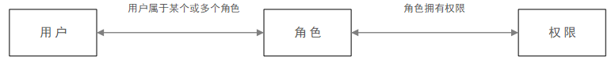
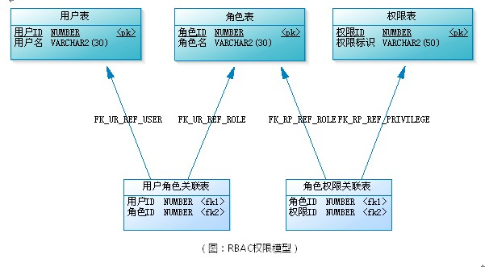

[TOC]

## 项目介绍

本项目旨在实现可用性高的基于互联网网页的小型分布式文件系统。在已有的项目的基础上，希望实现容器化服务器端、多用户权限支持、更高效的文件传输、减轻中央服务器负担、提高文件安全性和可用性等优化，做出可用性高的“私人网盘”。

## 理论依据

### 容器化技术

#### 容器化技术的优势

#### 容器化技术的代表：Docker

### 多用户权限支持——RBAC介绍

以角色为基础的访问控制（Role-based access control，RBAC），是一种较新且广为使用的访问控制机制，其不同于其他定访问控制直接赋予使用者权限，而是将权限赋予角色。

在一个组织中，会因为不同的职责产生不同的角色，执行某项操作的权限被赋予某个的角色。组织成员则被赋予不同的角色，这些用户通过被赋予角色来取得执行某系统功能的权限。

对于批量的用户权限调整，只需调整用户关联的角色权限，无需对每一个用户都进行权限调整，既提升效率，又降低了出现漏调的概率。

数据库设计示意图如下：

### 纠删码

#### 编解码原理

#### Reed–Solomon 码

### 分离数据与控制链接

### //其他

## 技术依据

### Docker

### 实现多用户权限支持的技术

#### 前置项目关于用户权限的设计

#### 达到改进目标用到的技术

### Reed-Solomon

### WebAssembly

### TODO 实现分离数据与控制链接的技术

#### //其他

## 技术路线

### 前端

### 客户端

### 服务器

### 其他

## 参考文献