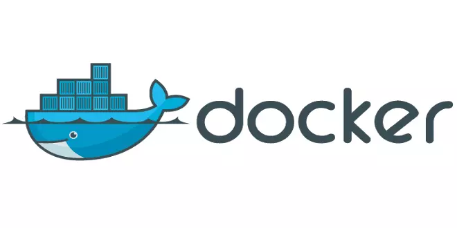
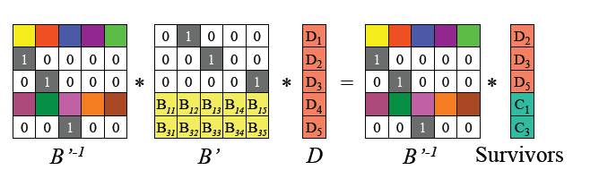
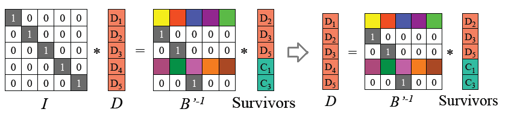
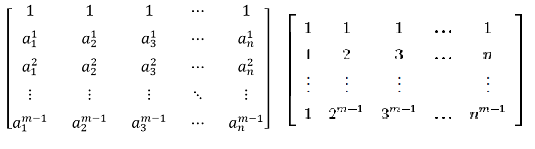
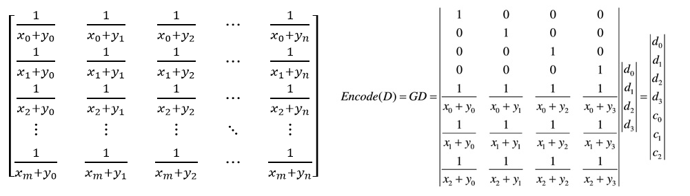
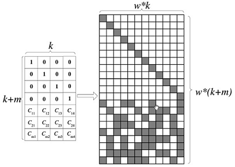

[TOC]

- [项目介绍](#%e9%a1%b9%e7%9b%ae%e4%bb%8b%e7%bb%8d)
- [理论依据](#%e7%90%86%e8%ae%ba%e4%be%9d%e6%8d%ae)
	- [容器化技术](#%e5%ae%b9%e5%99%a8%e5%8c%96%e6%8a%80%e6%9c%af)
		- [实现原理](#%e5%ae%9e%e7%8e%b0%e5%8e%9f%e7%90%86)
		- [为什么使用 Docker](#%e4%b8%ba%e4%bb%80%e4%b9%88%e4%bd%bf%e7%94%a8-docker)
	- [多用户权限支持 —— RBAC 介绍](#%e5%a4%9a%e7%94%a8%e6%88%b7%e6%9d%83%e9%99%90%e6%94%af%e6%8c%81--rbac-%e4%bb%8b%e7%bb%8d)
	- [Reed-Solomon 编码](#reed-solomon-%e7%bc%96%e7%a0%81)
		- [编解码原理](#%e7%bc%96%e8%a7%a3%e7%a0%81%e5%8e%9f%e7%90%86)
			- [编码](#%e7%bc%96%e7%a0%81)
			- [解码](#%e8%a7%a3%e7%a0%81)
		- [编码矩阵](#%e7%bc%96%e7%a0%81%e7%9f%a9%e9%98%b5)
			- [基于范德蒙德（Vandermonde）矩阵](#%e5%9f%ba%e4%ba%8e%e8%8c%83%e5%be%b7%e8%92%99%e5%be%b7vandermonde%e7%9f%a9%e9%98%b5)
			- [基于柯西（Cauchy）矩阵](#%e5%9f%ba%e4%ba%8e%e6%9f%af%e8%a5%bfcauchy%e7%9f%a9%e9%98%b5)
			- [柯西编解码过程优化](#%e6%9f%af%e8%a5%bf%e7%bc%96%e8%a7%a3%e7%a0%81%e8%bf%87%e7%a8%8b%e4%bc%98%e5%8c%96)
	- [分离数据与控制链接](#%e5%88%86%e7%a6%bb%e6%95%b0%e6%8d%ae%e4%b8%8e%e6%8e%a7%e5%88%b6%e9%93%be%e6%8e%a5)
		- [上传/下载速度的提升](#%e4%b8%8a%e4%bc%a0%e4%b8%8b%e8%bd%bd%e9%80%9f%e5%ba%a6%e7%9a%84%e6%8f%90%e5%8d%87)
			- [传统 C/S 模式](#%e4%bc%a0%e7%bb%9f-cs-%e6%a8%a1%e5%bc%8f)
			- [集中式对等网络](#%e9%9b%86%e4%b8%ad%e5%bc%8f%e5%af%b9%e7%ad%89%e7%bd%91%e7%bb%9c)
- [技术依据](#%e6%8a%80%e6%9c%af%e4%be%9d%e6%8d%ae)
	- [Docker 部署服务端](#docker-%e9%83%a8%e7%bd%b2%e6%9c%8d%e5%8a%a1%e7%ab%af)
	- [实现多用户权限支持的技术](#%e5%ae%9e%e7%8e%b0%e5%a4%9a%e7%94%a8%e6%88%b7%e6%9d%83%e9%99%90%e6%94%af%e6%8c%81%e7%9a%84%e6%8a%80%e6%9c%af)
		- [前置项目关于用户权限的设计](#%e5%89%8d%e7%bd%ae%e9%a1%b9%e7%9b%ae%e5%85%b3%e4%ba%8e%e7%94%a8%e6%88%b7%e6%9d%83%e9%99%90%e7%9a%84%e8%ae%be%e8%ae%a1)
			- [数据库配置](#%e6%95%b0%e6%8d%ae%e5%ba%93%e9%85%8d%e7%bd%ae)
		- [达到改进目标用到的技术](#%e8%be%be%e5%88%b0%e6%94%b9%e8%bf%9b%e7%9b%ae%e6%a0%87%e7%94%a8%e5%88%b0%e7%9a%84%e6%8a%80%e6%9c%af)
			- [新的数据库设计](#%e6%96%b0%e7%9a%84%e6%95%b0%e6%8d%ae%e5%ba%93%e8%ae%be%e8%ae%a1)
			- [新的 Web 端设计](#%e6%96%b0%e7%9a%84-web-%e7%ab%af%e8%ae%be%e8%ae%a1)
	- [纠删码的实现](#%e7%ba%a0%e5%88%a0%e7%a0%81%e7%9a%84%e5%ae%9e%e7%8e%b0)
		- [现有的开源项目](#%e7%8e%b0%e6%9c%89%e7%9a%84%e5%bc%80%e6%ba%90%e9%a1%b9%e7%9b%ae)
		- [应用 WebAssembly](#%e5%ba%94%e7%94%a8-webassembly)
		- [DOM API](#dom-api)
	- [Token 实现身份验证](#token-%e5%ae%9e%e7%8e%b0%e8%ba%ab%e4%bb%bd%e9%aa%8c%e8%af%81)
		- [Token 概述](#token-%e6%a6%82%e8%bf%b0)
		- [JWT 标准](#jwt-%e6%a0%87%e5%87%86)
		- [非对称加密](#%e9%9d%9e%e5%af%b9%e7%a7%b0%e5%8a%a0%e5%af%86)
		- [潜在风险](#%e6%bd%9c%e5%9c%a8%e9%a3%8e%e9%99%a9)
	- [OpenVPN 建立虚拟局域网](#openvpn-%e5%bb%ba%e7%ab%8b%e8%99%9a%e6%8b%9f%e5%b1%80%e5%9f%9f%e7%bd%91)
- [技术路线](#%e6%8a%80%e6%9c%af%e8%b7%af%e7%ba%bf)
	- [可移植性和易用性](#%e5%8f%af%e7%a7%bb%e6%a4%8d%e6%80%a7%e5%92%8c%e6%98%93%e7%94%a8%e6%80%a7)
	- [扩展至多人使用](#%e6%89%a9%e5%b1%95%e8%87%b3%e5%a4%9a%e4%ba%ba%e4%bd%bf%e7%94%a8)
	- [减轻中央服务器的负载](#%e5%87%8f%e8%bd%bb%e4%b8%ad%e5%a4%ae%e6%9c%8d%e5%8a%a1%e5%99%a8%e7%9a%84%e8%b4%9f%e8%bd%bd)
	- [采用工具](#%e9%87%87%e7%94%a8%e5%b7%a5%e5%85%b7)
	- [应用设想](#%e5%ba%94%e7%94%a8%e8%ae%be%e6%83%b3)
		- [小目标](#%e5%b0%8f%e7%9b%ae%e6%a0%87)
		- [大目标](#%e5%a4%a7%e7%9b%ae%e6%a0%87)
- [参考内容](#%e5%8f%82%e8%80%83%e5%86%85%e5%ae%b9)

## 项目介绍

本项目旨在实现可用性高的基于互联网网页的小型分布式文件系统。在已有的项目的基础上，希望实现容器化服务器端、多用户权限支持、更高效的文件传输、减轻中央服务器负担、提高文件安全性和可用性等优化，做出可用性高的“私人网盘”。

## 理论依据

### 容器化技术

在生产环境上，传统的手工部署方法可能会出现下列事件：

- 你的 Linux 发行版很老，而你需要运行一个给新版本的 Linux 或者完全不同的 Linux 发行版设计的程序。
- 你和朋友一起设计一个大型程序，由于你们的运行环境不同，有时候在某台机器上正常运行的程序，在另一台机器上没法正常运行。
- 你希望在多台服务器上部署同一个项目，但是项目需要非常复杂的配置，一个一个配置服务器的成本非常大。

而容器化技术可以方便解决上述问题，容器可以把应用及其依赖项都将打包成一个可以复用的镜像并与其他进程环境隔离。

在运行环境、网络拓扑、安全策略和存储方案变化时，软件可能会显现一些出乎意料的问题；而容器使开发环境和运行环境统一。同时容器并不像虚拟机那样模拟全部硬件（这对于很多轻量型应用是小题大做），它只虚拟化了文件系统、网络、运行环境等，在核心本地运行指令，不需要任何专门的接口翻译和系统调用替换机制，减少了很多虚拟化开销。

现有容器软件有 LXC/LXD、Docker、Solaris Zones、Kubernetes 等等。

#### 实现原理

CGroup（Control Groups）是 Linux 内核提供的一种可以限制、记录、隔离进程组使用的资源的系统。CGroup 将任意进程进行分组化管理，有内存控制器、进程调度控制器、虚拟文件系统等。运行中的内核可以用 CGroup 的子系统 /proc/cgroup 来确认。

Namespace，包括 CLONE_NEWCGROUP、CLONE_NEWIPC、CLONE_NEWNET、CLONE_NEWNS、CLONE_NEWPID、CLONE_NEWUSER、CLONE_NEWUTS 这七个选项，是对全局系统资源的一种封装隔离。处于不同 Namespace 的进程拥有独立的全局系统资源，改变一个 Namespace 中的系统资源只会影响当前 Namespace 里的进程，对其他 Namespace 中的进程没有影响。内核将这些命名空间保存在 /proc/\[pid\]/ns/ 目录下。

#### 为什么使用 Docker



Docker 使用了 CGroup 和 Namespace 去隔离不同容器内的进程。Docker 容器将应用和其依赖环境打包在一起，在不包含完整的操作系统时就能运行普通应用，更加轻量级，可移植性更好。Docker 的可移植性和轻量级的特性，可以使我们轻松地完成动态管理的工作负担，并根据需求指示，实时扩展或拆除应用程序和服务。

Docker 中的每一个镜像都是由一系列的只读层组成的，Dockerfile 中的每一个命令都会在已有的只读层上创建一个新的层。docker run 可以在镜像的最上层添加一个可写的容器层，所有运行时容器的修改其实都是对这个容器读写层的修改。这样的特性使得 Docker 具有一定版本管理的功能。

### 多用户权限支持 —— RBAC 介绍

以角色为基础的访问控制（Role-based access control，RBAC），是一种较新且广为使用的访问控制机制。不同于其他的访问控制直接赋予使用者权限，RBAC 将权限赋予角色。


在一个组织中，根据不同的职责产生不同的角色，执行某项操作的权限被赋予对应的角色。组织成员通过被赋予不同的角色，从而取得执行某系统功能的权限。

对于批量的用户权限调整，只需调整用户关联的角色权限，无需对每一个用户都进行权限调整，既提升效率，又降低了出现漏调的概率。

数据库设计示意图如下：


### Reed-Solomon 编码

纠删码（Erasure Code）是一种编码技术。它通过计算将 n 份原始数据增加至 n+m 份数据，并能由其中的任意 n 份数据还原出原始数据，即可以容忍不多于 m 份的数据失效。纠删码主要应用在网络传输中，用以提高存储系统的可靠性。相比多副本复制而言， 它能以更小的数据冗余度获得更高数据可靠性， 但编码方式较复杂，需要大量计算。

里德-所罗门码（Reed-Solomon codes，RS codes）是纠删码的一类，常被应用在分布式文件系统中，我们希望使用它来提升文件系统的可靠性。下面介绍它的编解码原理。

#### 编解码原理

##### 编码

RS 编码以 word 为编码和解码单位，大的数据块拆分到字长为 w（取值一般为 8 或者 16 位）的 word，然后对 word 进行编解码。数据块的编码原理与 word 编码原理相同。把输入数据视为向量 D = (D1, D2, .., Dn), 编码后数据视为向量 (D1, D2, .., Dn, C1, C2, .., Cm)，RS 编码可视为如下图所示矩阵运算。


上图最左边是编码矩阵（或称为生成矩阵、分布矩阵，Distribution Matrix），编码矩阵需要满足任意 n\*n 子矩阵可逆。为方便数据存储，编码矩阵上部是单位阵，下部是 m\*n 矩阵。下部矩阵可以选择范德蒙德矩阵或柯西矩阵。

##### 解码

RS 最多能容忍 m 个数据块被删除，数据恢复的过程如下：

- 假设 D1、D4、C2 丢失，从编码矩阵中删掉丢失的数据块/编码块对应的行。根据 RS 编码运算等式，可以得到 B' 以及等式：


- 由于 B' 是可逆的，记 B' 的逆矩阵为 B'^(-1)，则 B'\*B'^(-1) = I 单位矩阵。两边左乘 B' 逆矩阵：



- 得到如下原始数据 D 的计算公式，从而恢复原始数据 D：



#### 编码矩阵

##### 基于范德蒙德（Vandermonde）矩阵

在线性代数中有一种矩阵称为范德蒙德矩阵，它的任意的子方阵均为可逆方阵。

一个 m 行 n 列的范德蒙德矩阵定义如下图左边，其中 Ai 均不相同，且不为 0。令 A1, A2, .., An 分别为 1, 2, 3, .., n，则得到范德蒙德矩阵为下图右边：



编码矩阵就是单位矩阵和范德蒙德矩阵的组合。输入数据 D 和编码矩阵的乘积就是编码后的数据。

采用这种方法的算法复杂度还是比较高的，编码复杂度为 O(mn)，其中 m 为校验数据个数，n 为输入数据个数。解码复杂度为 O(n^3)。

##### 基于柯西（Cauchy）矩阵

柯西矩阵的任意一个子方阵都是奇异矩阵，存在逆矩阵。而且柯西矩阵在迦罗华域上的求逆运算，可以在 O(n^2) 的运算复杂度内完成。使用柯西矩阵，比范德蒙德矩阵的优化主要有两点：

- 降低了矩阵求逆的运算复杂度。范德蒙矩阵求逆运算的复杂度为 O(n^3)，而柯西矩阵求逆运算的复杂度仅为 O(n^2)。
- 通过有限域转换，将 GF(2^w) 域中的元素转换成二进制矩阵，将乘法转换为逻辑与，降低了乘法运算复杂度。（二进制的加法即 XOR，乘法即 AND）

柯西矩阵的描述如下图左边，Xi 和 Yi 都是迦罗华域 GF(2^w) 中的元素。右边是基于柯西矩阵的编码矩阵：



##### 柯西编解码过程优化

在范德蒙编码的时候，我们可以采用对数/反对数表的方法，将乘法运算转换成了加法运算，并且在迦罗华域中，加法运算转换成了 XOR 运算。

柯西编解码为了降低乘法复杂度，采用了有限域上的元素都可以使用二进制矩阵表示的原理，将乘法运算转换成了迦罗华域“AND 运算”和“XOR 逻辑运算”，提高了编解码效率。

从数学的角度，在迦罗华有限域中，任何一个 GF(2^w) 域上的元素都可以映射到 GF(2) 二进制域，并且采用一个二进制矩阵的方式表示 GF(2^w) 中的元素。例如 GF(2^3) 域中的元素可以表示成 GF(2) 域中的二进制矩阵：


上图中，黑色方块表示逻辑 1，白色方块表示逻辑 0。通过这种转换，GF(2^w) 域中的阵列就可以转换成 GF(2) 域中的二进制阵列。生成矩阵的阵列转换表示如下：



在 GF(2^w) 域中的编码矩阵为 K\*(K+m)，转换到 GF(2) 域中，使用二进制矩阵表示，编码矩阵变成了 wk\*w(k+m) 二进制矩阵。采用域转换的目的是简化 GF(2^w) 域中的乘法运算。在 GF(2) 域中，乘法运算变成了逻辑与运算，加法运算变成了 XOR 运算，可以大大降低运算复杂度。

和范德蒙编解码中可能使用的对数/反对数方法相比，这种方法不需要构建对数或反对数表，可以支持 w 为很大的 GF 域空间。采用这种有限域转换的方法之后，柯西编码运算可以表示如下：


使用柯西矩阵要优于范德蒙德矩阵的方法，柯西矩阵的运算复杂度为 O(n*(n-m))，解码复杂度为 O(n^2)。

### 分离数据与控制链接

在传统的 Client-Server 模式中，数据的分发采用专门的服务器，多个客户端都从此服务器获取数据。这种模式的优点是：数据的一致性容易控制，系统也容易管理。但是此种模式的缺点是：因为服务器的个数只有一个，单一服务器面对众多的客户端，由于 CPU 能力、内存大小、网络带宽的限制，可同时服务的客户端非常有限，可扩展性差。

对等网络结构正是为了解决这些问题而提出来的。其中的集中式对等网络模式，类似曾经的 Napster 提供服务的方式 —— Napster 允许普通用户的机器成为一台服务器，为其它用户提供下载，它的中央的服务器本身是一个“目录”，用户真正的下载是直接连接其他用户的服务器。这样的方式将控制连接和数据连接分离开来，有效地将中央服务器的负载分担到了各个用户的机器上。同时，因为保留了中央服务器，对于用户的访问权限容易控制，系统也容易管理，对于一个小型的分布式文件系统来说再适合不过了。

#### 上传/下载速度的提升

以下载文件的过程为例，进行分离数据连接和控制连接在本项目的分布式文件系统中带来效率改变的分析。

##### 传统 C/S 模式

在传统 Client-Server 模式下，假设中央服务器上行/下载带宽为 us/ds，各存储节点上行/下载带宽为 ui/di，访问文件系统的用户为 ut/dt。每个存储节点上文件碎片的大小为 fi，文件总大小为 f。

访问文件系统的用户仅仅与中央服务器通信，存储节点也只与中央服务器通信。需要下载的文件由服务器向存储节点收集碎片，拼接之后传输给用户。


假设中间途经的网络是理想的，控制连接花费的时间不计，那么用户从发出下载请求到得到文件所花费的时间为：


这仅仅是一个用户发起请求的情况，假如存在 n 个上传/下载请求需要处理，那么服务器的带宽 us/ds，将会缩水成原来的 1/n。很显然，公式中的瓶颈在于us/ds。

##### 集中式对等网络

在集中式对等网络下，同样假设中央服务器上行/下载带宽为 us/ds，各存储节点上行/下载带宽为 ui/di，访问文件系统的用户为 ut/dt。每个存储节点上文件碎片的大小为 fi，文件总大小为 f。

此时访问文件系统的用户与中央服务器的连接为控制连接，存储节点同样。下载文件时，数据连接直接建立在存储节点和用户之间，用户直接拿到文件碎片并拼接得到文件。


假设中间途经的网络是理想的，控制连接花费的时间不计，那么用户从发出下载请求到得到文件所花费的时间为：


显然，式中不包含 us/ds。当存在多个请求时服务器带宽将不再是瓶颈，同时也避免了文件中转一次的时间开销。

## 技术依据

### Docker 部署服务端

本项目使用了 Apache 和 Tomcat，使用网页作为用户的交互页面。Apache 作为一个 Web 服务器，缺乏处理 JSP 的功能，为了能够处理 JSP 的请求，需要使用 JSP 容器如 Tomcat。mod_jk（JK）是 Apache 与 Tomcat 的连接器，附带集群和负载均衡。就 Docker 而言，应该对每个服务使用单独容器，如 Web 服务器运行在一个容器上，应用程序服务器运行在另一个容器上。若采用 Apache 和 Tomcat 方案分别部署 HTML 和 JSP 页面，则容易使用 Docker 分别管理 Apache 和 Tomcat，动静分离。

使用 Docker 创建容器时，基础镜像通常是 Ubuntu 或 Centos，不管哪个镜像的大小都在 100MB 以上。Alpine Linux 采用了 musl libc 和 busybox 以减小系统的体积和运行时消耗，相比于其他 Linux 的 Docker 镜像，它的占用仅仅只有 5MB。故项目会采用 docker-alpine-java 镜像，同时提供 JRE 运行时和较小的镜像体积。

### 实现多用户权限支持的技术

#### 前置项目关于用户权限的设计

##### 数据库配置

服务器数据库模块负责分布式文件系统的数据库访问，包括封装了数据库访问方法的Query 类与用于定义数据结构的 FileItem、DeviceItem、RequestItem 类。

本分布式文件系统使用数据库维护所有的元数据，数据库中具体包括表 FILE 用于存储文件的逻辑位置与属性、表 FRAGMENT 用于存储碎片的物理位置、表 REQUEST 用于存储服务器对客户端的碎片请求、表 DEVICE 用于存储系统中客户端的信息、表 USER 用于存储网页的注册用户。

```mysql
CREATE TABLE `DEVICE` (
`ID` int NOT NULL AUTO_INCREMENT,
`IP` char(20) NOT NULL DEFAULT '',
`PORT` int NOT NULL DEFAULT 0,
`ISONLINE` boolean NOT NULL,
`RS` int NULL DEFAULT 0 ,
PRIMARY KEY (`ID`)
) ENGINE=InnoDB DEFAULT CHARSET=utf8;

CREATE TABLE `FRAGMENT` (
`ID` int NOT NULL,
`PATH` char(20) NOT NULL DEFAULT '',
PRIMARY KEY (`ID`)
) ENGINE=InnoDB DEFAULT CHARSET=utf8;

CREATE TABLE `FILE` (
`ID` int NOT NULL AUTO_INCREMENT,
`NAME` char(20) NOT NULL DEFAULT '',
`PATH` char(60) NOT NULL DEFAULT '',
`ATTRIBUTE` char(10) NOT NULL DEFAULT '',
`TIME` char(10) NOT NULL DEFAULT '',
`NOA` int NOT NULL DEFAULT 1,
`ISFOLDER` boolean NOT NULL DEFAULT false,
PRIMARY KEY (`id`)
) ENGINE=InnoDB DEFAULT CHARSET=utf8;

CREATE TABLE `REQUEST` (
`ID` int NOT NULL AUTO_INCREMENT,
`TYPE` int NOT NULL DEFAULT 0,
`FRAGMENTID` int NOT NULL DEFAULT 0,
`DEVICEID` int NOT NULL DEFAULT 0,
PRIMARY KEY (`ID`)
) ENGINE=InnoDB DEFAULT CHARSET=utf8;

CREATE TABLE `USER` (
`ID` int NOT NULL AUTO_INCREMENT,
`NAME` char(20) NOT NULL UNIQUE DEFAULT '',
`PASSWD` char(20) NOT NULL DEFAULT '',
PRIMARY KEY (`ID`)
) ENGINE=InnoDB DEFAULT CHARSET=utf8;

CREATE UNIQUE INDEX `idx_FILE_PATH_NAME` ON `DFS`.`FILE` (PATH, NAME)
COMMENT '' ALGORITHM DEFAULT LOCK DEFAULT;
CREATE UNIQUE INDEX `idx_USER_NAME` ON `DFS`.`USER` (NAME) COMMENT ''
ALGORITHM DEFAULT LOCK DEFAULT;
```

Query 类定义了对上述五个表查询、修改、删除、新增条目的函数，其通过 JDBC 接口实现了对数据的访问，访问的流程为：

（一）在构造函数中使用 DriverManager.getConnection 函数创建到数据库的连接（一个Connection 类实例）；

（二）通过 Connection 类实例的 createStatement 函数创建一个 Statement 类实例；

（三）通过 Statement 类实例的 executeQuery 函数执行 SQL，SQL 的内容可以使用格式化字符串根据函数的参数填入不同的内容，该函数将返回一个 ResultSet 类实例；

（四）对 ResultSet 类实例，使用 next 函数与 getInt、getBoolean、getString 等函数遍历查询的每个结果；

（五）对 ResultSet 类实例与 Statement 类实例，执行 close 函数关闭连接；

（六）在 closeConnection 函数中，调用 Connection 类实例 close 函数关闭连接。

#### 达到改进目标用到的技术

##### 新的数据库设计

RBAC是基于角色的权限访问技术，需要设计新的数据表：

```code
用户表
角色表
权限表
用户角色表
角色权限表
```

考虑到本项目私人网盘的定位，设计思路如下：

- 每个用户创建时，同时生成同名的角色，角色唯一对应只有自己有权限访问的网盘空间，即角色与权限一对一，权限包含浏览内容和下载等等；
- 提供创建小组的功能：角色表生成新的小组角色，小组角色唯一对应网盘空间，权限仍为一对一；
- 同时考虑用户与小组两类角色，用户与角色是多对多的关系。为了建立更明晰的表格，将用户-用户权限严格绑定，只额外建立用户小组角色表，暂考虑用户只能加入0或1个小组；
- 从分析可以看出，角色与权限一一对应，可以把角色权限表、权限表纳入角色表中，即只需用户表、小组角色表、用户小组角色表；
- 暂不考虑超级管理员。

具体设计如下：（待实现的加粗显示）

- 表 FILE 用于存储文件的逻辑位置与属性
- 表 FRAGMENT 用于存储碎片的物理位置
- 表 REQUEST 用于存储服务器对客户端的碎片请求
- 表 DEVICE 用于存储系统中客户端的信息
- **表 USER 用于存储网页的注册用户**
- **表 GROUP_ROLE 用于存储小组角色**
- **表 USER_GROUP 用于存储用户对应小组角色的信息**

```mysql
CREATE TABLE `USER` (
`ID` int NOT NULL AUTO_INCREMENT,
`NAME` char(20) NOT NULL UNIQUE DEFAULT '',
`PASSWD` char(20) NOT NULL DEFAULT '',
`URIS` varchar(1000) NOT NULL DEFAULT '',
PRIMARY KEY (`ID`)
) ENGINE=InnoDB DEFAULT CHARSET=utf8;

CREATE TABLE `GROUP_ROLE` (
`ID` int NOT NULL AUTO_INCREMENT,
`NAME` char(20) NOT NULL UNIQUE DEFAULT '',
`URIS` varchar(1000) NOT NULL DEFAULT '',
PRIMARY KEY (`ID`)
) ENGINE=InnoDB DEFAULT CHARSET=utf8;

CREATE TABLE `USER_GROUP` (
`ID` int NOT NULL AUTO_INCREMENT,
`GID` int NOT NULL DEFAULT '0',
PRIMARY KEY (`ID`)
) ENGINE=InnoDB DEFAULT CHARSET=utf8;
```

##### 新的 Web 端设计

思路如下：（待实现的加粗显示）

- 注册时，判断用户名不重复，**分配 ID 等等数据模块**；
- 登录时，输入用户名、密码，检测对应模块，**跳转至特定文件空间（涉及到由抓取所有文件列表到抓取特定文件列表的转变）**；
- **原网页基础上添加创建小组、加入小组等功能（涉及到网页设计以及和数据库交互）**。

### 纠删码的实现

纠删码本身目前已经是一种比较成熟的算法，且其中的 Reed-Solomon 算法是比较早并且已经有开源实现的一种算法，相对引入系统的难度较低。此外，为了在浏览器端实现文件编解码以减少服务器的工作量，我们希望应用 WebAssembly 编译现有的开源算法。

#### 现有的开源项目

数据储存服务供应商 Backblaze 在 GitHub 开源提供了一个使用 Java 编写的 Reed-Solomon 库。以此为基础实现了许多其他语言如 Go、Python 编写的 RS 码实现，其中 Go 语言的实现有较多的 Star 量，内容也较为完善。我们希望能够在浏览器上应用它，而这需要借助 WebAssembly。

#### 应用 WebAssembly

WebAssembly 是一个实验性的低级编程语言，应用于浏览器内的客户端。

在过去很长一段时间里，JavaScript 是 Web 开发人员中的通用语言。如果想写一个稳定成熟的 Web 应用程序，用 JavaScript 几乎是唯一的方法。WebAssembly（也称为 wasm）将很快改变这种情况。它是便携式的抽象语法树，被设计来提供比 JavaScript 更快速的编译及运行。 WebAssembly 将让开发者能运用自己熟悉的编程语言（最初以 C/C++ 作为实现目标）编译，再藉虚拟机引擎在浏览器内运行。

WebAssembly 的开发团队分别来自 Mozilla、Google、Microsoft、Apple，代表着四大网络浏览器 Firefox、Chrome、Microsoft Edge、Safari。2017 年 11 月，以上四个浏览器都开始实验性的支持 WebAssembly。WebAssembly 于 2019 年 12 月 5 日成为万维网联盟（W3C）的推荐，与 HTML、CSS 和 JavaScript 一起，成为 Web 的第四种语言。

#### DOM API

//TODO

文档对象模型（Document Object Model，简称 DOM），是 W3C 组织推荐的处理可扩展置标语言的标准编程接口。它是一种与平台和语言无关的应用程序接口（API），它可以动态地访问程序和脚本，更新其内容、结构和 www 文档的风格（目前，HTML 和 XML 文档是通过说明部分定义的）。

要使 Go 代码与浏览器进行交互，我们需要一个 DOM API。我们有 `syscall/js` 库来帮助我们解决这个问题。它是一个非常简单却功能强大的 DOM API 形式，我们可以在其上构建我们的应用程序。

### Token 实现身份验证

在数据连接和控制连接分离之后，用户直接与存储节点建立数据连接，此时需要在存储节点实现对用户身份的验证，来保证安全性。

#### Token 概述

使用基于 Token 的身份验证方法，在服务端不需要存储用户的登录记录。大概的流程是这样的：

- 客户端使用用户名跟密码请求登录
- 服务端收到请求，去验证用户名与密码
- 验证成功后，服务端会签发一个 Token，再把这个 Token 发送给客户端
- 客户端收到 Token 以后可以把它存储起来，比如放在 Cookie 里或者 Local Storage 里
- 客户端每次向服务端请求资源的时候需要带着服务端签发的 Token
- 服务端收到请求，然后去验证客户端请求里面带着的 Token，如果验证成功，就向客户端返回请求的数据

#### JWT 标准

Token 的实现方式可以有很多，下面以 JSON Web Tokens 为例。

JWT 标准的 Token 有三个部分：

- header（头部）
- payload（数据）
- signature（签名）

Header 用于说明如何处理这个 Token，包含的属性 alg 用于指明加密算法

```json
{
    "alg": "HS256"
}
```

Payload 里面是 Token 的具体内容，这些内容里面有一些是标准字段，也可以添加其它需要的内容。

例如：

```json
{
    "user": "ruby",
    "admin": true,
    "exp": "xxx",
    "fileID": "3"
}
```

Signature 里有三个部分，先是用 Base64 编码的 header和payload ，再用加密算法加密。加密的时候放入一个 Secret ，这是一个秘密地存储在服务端的密码。

加密过程类似这样：

```js
const encodedString = base64UrlEncode(header) + "." + base64UrlEncode(payload);
HMACSHA256(encodedString, 'secret');
```

#### 非对称加密

非对称加密算法生成一对公钥和私钥，公钥加密的内容只能用私钥解密，反之同理。并且得到其中一个密钥之后，在数学计算复杂度的意义上很难通过现有手段暴力破解出另一个密钥。因此，在非对称加密的使用中，可以较为放心地发送公钥，而不用担心私钥被破解。

在 Token 的使用过程中采用非对称加密的方式：服务器生成一对密钥，用私钥签发 Token 给用户；公钥分发给各存储设备，用于验证用户 Token 的合法性。这样就可以在存储设备验证用户身份的合法性。

#### 潜在风险

Token 一旦泄露，将会授予拿到 Token 的非法用户合法的权限，这不利于在分布式文件系统中保障数据的安全性。

可以通过两个途径解决：

1. 加密传输 Token，例如使用 sslsocket 替代普通 socket
2. 对文件进行加密，保证收集到足够碎片也无法复原文件。

### OpenVPN 建立虚拟局域网

数据连接直接建立在用户和存储设备之间还会产生一个问题：寻址。中央服务器通常有公网IP，但是寻常的存储设备在NAT之后。两个在 NAT 背后的设备没有办法直接通信。

采用 OpenVPN 构建虚拟的局域网，使得当存储设备和用户不在同一个局域网内时，也能够进行寻址。

工作原理：

OpenVPN 服务器一般需要配置一个虚拟 IP 地址池和一个自用的静态虚拟 IP 地址（静态地址和地址池必须在同一个子网中），然后为每一个成功建立SSL连接的客户端动态分配一个虚拟 IP 地址池中未分配的地址。这样，物理网络中的客户端和 OpenVPN 服务器就连接成一个虚拟网络上的星型结构局域网，OpenVPN 服务器成为每个客户端在虚拟网络上的网关。OpenVPN 服务器同时提供对客户端虚拟网卡的路由管理。当客户端对 OpenVPN 服务器后端的应用服务器的任何访问时，数据包都会经过路由流经虚拟网卡，OpenVPN程序在虚拟网卡上截获数据IP报文，然后使用SSL协议将这些IP报文封装起来，再经过物理网卡发送出去。OpenVPN的服务器和客户端在虚拟网卡之上建立起一个虚拟的局域网络，这个虚拟的局域网对系统的用户来说是透明的。

为了充分利用直接进行数据连接的传输效率，可以对以下情况分类处理：

1. 存储设备已经有公网IP，直接访问
2. 存储设备和用户在一个物理局域网内，直接访问
3. 1、2外的其他情况，采用 OpenVPN 的虚拟局域网。

## 技术路线

为了减少不必要的重复劳动，本项目将基于[往届 OSH 项目](https://github.com/IngramWang/DFS_OSH2017_USTC)进行优化。

综合上述内容，我们希望通过优化已有项目，形成一个可用性高的私人分布式网盘服务。

优化的目的和方法如下：

### 可移植性和易用性

存储节点已经采用 JVM，用户端已经采用 Web，这两者已经实现了很好的跨平台和易用性。对于服务器端，我们将通过 Docker 化增强可移植性，降低部署难度。

### 扩展至多人使用

通过重新设计数据库和网页前后端，提供对不同用户独立的文件列表，同时增加对团队的支持，达到将服务扩展至多人的目的。

### 减轻中央服务器的负载

其一，是将纠删码的实现移到浏览器端，通过使用 WebAssembly 保证效率。

其二，文件的传输不再通过中央服务器中转，即用户直接和存储节点传输数据。采用 Token 进行用户身份合法性的验证。对于可能的 NAT 寻址问题，采用 OpenVPN 构建虚拟局域网解决。

### 采用工具

目前已确定采用的工具：

- Docker
- Apache + Tomcat
- Mysql
- WebAssembly
- OpenVPN

### 应用设想

#### 小目标

个人或者小团体通过 Docker 轻松部署一台中央服务器，服务器的用途在于接收控制连接和维护数据库状态，因此对配置要求较低。通过在自己的设备上运行跨平台的 Java 客户端成为存储节点，贡献存储空间。对于文件的访问和管理采用 Web 浏览器，每个用户只会看到自己的文件。用户可以创建和加入团队，团队也有自己的文件列表，共享文件也很方便。

#### 大目标

在小目标的基础上，还可以进一步对安全性进行改进。例如对文件进行加密，和调整文件碎片的分发策略，使得恶意用户不可能收集到其他人的足够文件碎片并还原出原始文件。

对于用户和存储节点无法直接连接的处理，改为使用 NAT 穿透，实现真正的直接连接。

考虑到存储节点在线率对下载文件的影响，调整分发文件碎片的策略，对不同在线率进行区分，例如对始终在线的节点（vps）分发更多的碎片。

## 参考内容

- [容器化技术与 Docker](https://www.jianshu.com/p/34efcaa92ae4)
- [Linux 101](https://101.ustclug.org/Ch08/)
- [Erasure Code - EC纠删码原理](https://blog.csdn.net/shelldon/article/details/54144730)
- [P2P 网络原理](https://www.cnblogs.com/ygjzs/p/12419548.html)
- [P2P 技术原理](https://www.oschina.net/question/54100_2285064)
- [github.com/Paritosh-Anand/Docker-Httpd-Tomcat](https://github.com/Paritosh-Anand/Docker-Httpd-Tomcat)
- [github.com/EdSingleton/docker-httpd-mod_jk](https://github.com/EdSingleton/docker-httpd-mod_jk)
- [github.com/peer44/java-rbac](https://github.com/peer44/java-rbac)
- [译 Go和WebAssembly：在浏览器中运行Go程序](https://www.qichengzx.com/2019/01/01/go-in-the-browser.html)
- [Wikipedia]()
- [基于 Token 的身份验证：JSON Web Token](https://ninghao.net/blog/2834)
- [OpenVPN 的工作原理](http://blog.sina.com.cn/s/blog_6d51d1b70101cs5m.html)
