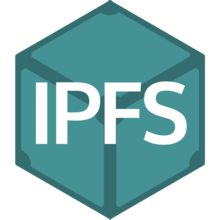

# 调研报告

- [调研报告](#%e8%b0%83%e7%a0%94%e6%8a%a5%e5%91%8a)
  - [项目成员](#%e9%a1%b9%e7%9b%ae%e6%88%90%e5%91%98)
  - [项目简介](#%e9%a1%b9%e7%9b%ae%e7%ae%80%e4%bb%8b)
  - [项目背景](#%e9%a1%b9%e7%9b%ae%e8%83%8c%e6%99%af)
    - [分布式文件系统](#%e5%88%86%e5%b8%83%e5%bc%8f%e6%96%87%e4%bb%b6%e7%b3%bb%e7%bb%9f)
      - [使用分布式系统的必要性](#%e4%bd%bf%e7%94%a8%e5%88%86%e5%b8%83%e5%bc%8f%e7%b3%bb%e7%bb%9f%e7%9a%84%e5%bf%85%e8%a6%81%e6%80%a7)
      - [传统分布式文件系统的局限性](#%e4%bc%a0%e7%bb%9f%e5%88%86%e5%b8%83%e5%bc%8f%e6%96%87%e4%bb%b6%e7%b3%bb%e7%bb%9f%e7%9a%84%e5%b1%80%e9%99%90%e6%80%a7)
    - [容器化技术](#%e5%ae%b9%e5%99%a8%e5%8c%96%e6%8a%80%e6%9c%af)
      - [容器化技术解决的问题](#%e5%ae%b9%e5%99%a8%e5%8c%96%e6%8a%80%e6%9c%af%e8%a7%a3%e5%86%b3%e7%9a%84%e9%97%ae%e9%a2%98)
      - [容器化技术的优势](#%e5%ae%b9%e5%99%a8%e5%8c%96%e6%8a%80%e6%9c%af%e7%9a%84%e4%bc%98%e5%8a%bf)
      - [容器化技术的代表：Docker](#%e5%ae%b9%e5%99%a8%e5%8c%96%e6%8a%80%e6%9c%af%e7%9a%84%e4%bb%a3%e8%a1%a8docker)
        - [诞生背景](#%e8%af%9e%e7%94%9f%e8%83%8c%e6%99%af)
        - [Docker 简介](#docker-%e7%ae%80%e4%bb%8b)
        - [Docker 使用方法](#docker-%e4%bd%bf%e7%94%a8%e6%96%b9%e6%b3%95)
    - [基于 OpenVPN 的局域网](#%e5%9f%ba%e4%ba%8e-openvpn-%e7%9a%84%e5%b1%80%e5%9f%9f%e7%bd%91)
      - [工作原理](#%e5%b7%a5%e4%bd%9c%e5%8e%9f%e7%90%86)
    - [Erasure Code](#erasure-code)
      - [什么是 Erasure Code](#%e4%bb%80%e4%b9%88%e6%98%af-erasure-code)
      - [RS Code编码原理](#rs-code%e7%bc%96%e7%a0%81%e5%8e%9f%e7%90%86)
      - [RS Code 编码数据恢复原理](#rs-code-%e7%bc%96%e7%a0%81%e6%95%b0%e6%8d%ae%e6%81%a2%e5%a4%8d%e5%8e%9f%e7%90%86)
      - [RS Code 编码的限制](#rs-code-%e7%bc%96%e7%a0%81%e7%9a%84%e9%99%90%e5%88%b6)
  - [立项依据](#%e7%ab%8b%e9%a1%b9%e4%be%9d%e6%8d%ae)
  - [前瞻性/重要性分析](#%e5%89%8d%e7%9e%bb%e6%80%a7%e9%87%8d%e8%a6%81%e6%80%a7%e5%88%86%e6%9e%90)
    - [容器化部署简易](#%e5%ae%b9%e5%99%a8%e5%8c%96%e9%83%a8%e7%bd%b2%e7%ae%80%e6%98%93)
    - [跨平台](#%e8%b7%a8%e5%b9%b3%e5%8f%b0)
    - [Erasure Code 冗余备份](#erasure-code-%e5%86%97%e4%bd%99%e5%a4%87%e4%bb%bd)
    - [加入多用户权限支持](#%e5%8a%a0%e5%85%a5%e5%a4%9a%e7%94%a8%e6%88%b7%e6%9d%83%e9%99%90%e6%94%af%e6%8c%81)
    - [更高效的文件处理和传输](#%e6%9b%b4%e9%ab%98%e6%95%88%e7%9a%84%e6%96%87%e4%bb%b6%e5%a4%84%e7%90%86%e5%92%8c%e4%bc%a0%e8%be%93)
    - [提高文件安全性](#%e6%8f%90%e9%ab%98%e6%96%87%e4%bb%b6%e5%ae%89%e5%85%a8%e6%80%a7)
    - [提高服务可用性](#%e6%8f%90%e9%ab%98%e6%9c%8d%e5%8a%a1%e5%8f%af%e7%94%a8%e6%80%a7)
  - [相关工作（科研及工业界）](#%e7%9b%b8%e5%85%b3%e5%b7%a5%e4%bd%9c%e7%a7%91%e7%a0%94%e5%8f%8a%e5%b7%a5%e4%b8%9a%e7%95%8c)
    - [Google File System](#google-file-system)
    - [Cooperative File System](#cooperative-file-system)
    - [Interplanetary File System](#interplanetary-file-system)
    - [Ceph](#ceph)
    - [Hadoop Distributed File System](#hadoop-distributed-file-system)
    - [Network File System](#network-file-system)
    - [分布式文件系统间的对比](#%e5%88%86%e5%b8%83%e5%bc%8f%e6%96%87%e4%bb%b6%e7%b3%bb%e7%bb%9f%e9%97%b4%e7%9a%84%e5%af%b9%e6%af%94)
  - [参考文献](#%e5%8f%82%e8%80%83%e6%96%87%e7%8c%ae)

## 项目成员

- 罗丽薇
- 邱子悦
- 袁一玮
- 余致远

## 项目简介

本项目旨在实现可用性高的基于互联网网页的小型分布式文件系统。在已有的项目的基础上，希望实现容器化服务器端、多用户权限支持、更高效的文件传输、减轻中央服务器负担、提高文件安全性和可用性等优化，做出可用性高的“私人网盘”。

[参考项目](https://github.com/IngramWang/DFS_OSH2017_USTC)

## 项目背景

### 分布式文件系统

分布式文件系统（Distributed File System）是指文件系统管理的物理存储资源不直接连接在本地节点上，而是通过计算机网络与节点（可简单的理解为一台计算机）相连。分布式文件系统的设计同样基于客户机/服务器模式：一个典型的网络可能包括多个供用户访问的服务器，但对等特性允许一些系统扮演客户机和服务器的双重角色。用户可以公开一个允许其他客户机访问的目录，一旦被访问，这个目录对客户机来说就像使用本地驱动器一样。

#### 使用分布式系统的必要性

中心化服务器能提供连接的带宽服务、数据储存是有限的，集中访问时会出现网络拥堵；中心化的存储服务也有安全隐患。

大数据时代，互联网凸显了以下问题：如何快速且经济地分发数据；如何记录大规模数据的版本迭代；如何有效储存避免丢失重要文件。互联网从 Client/Server 的主从结构、到CDN网络分发的小组织结构、到分布式分发网络的变化，体现了单点服务的不足。

#### 传统分布式文件系统的局限性

随着社会经济的发展与信息化进程的继续，台式计算机、膝上电脑、智能手机、平板电脑和更多的智能可穿戴设备正疯狂涌入当前的家庭和小微企业。这些设备极大地提高了企业的办公效率、丰富了家庭的娱乐需求，但如何高效地利用分散在这些不同的设备上的存储空间如今正越发成为大家关注的问题：运用好这些分散的存储空间不仅可以方便多人合作办公，更可以避免资源的浪费。

而家庭和小微企业的存储设备有如下特点：

- 存储资源小而分散，每个设备的存储容量通常不超过 1 TB；
- 设备通常只有在使用时才会在线联网，否则处于关闭状态；
- 很多设备的位置随时间而变化，故它们常常并不总在其归属网络上；
- 和专用的服务器相比，这些设备的性能较低；
- 设备没有统一的指令集和操作系统；
- 连接设备的网络环境较差，往往通过一般的局域网或互联网相连接。

面对这些特点，很难用一个集中式的文件系统组织分散在这些不同的设备上的存储空间。

然而，即使是传统的分布式文件系统想在这种环境中应用也是十分困难的，这体现在：

- 传统的分布式文件系统往往要求高性能、稳定的服务器，而上述环境中的机器不但性能不足，更不常在线；
- 传统的分布式文件系统往往要求服务器具有相同的操作系统甚至是定制的操作系统以方便管理，而上述环境中的机器运行不同的操作系统上；

同时，各大商业网盘的安全性深受质疑，限速或者收费等限制并不能很好地满足我们对存储的需要。

### 容器化技术

容器是轻量级的操作系统级虚拟化，可以让我们在一个资源隔离的进程中运行应用及其依赖项。运行应用程序所必需的组件都将打包成一个镜像并可以复用。执行镜像时，它运行在一个隔离环境中，并且不会共享宿主机的内存、CPU 以及磁盘，这就保证了容器内进程不能监控容器外的任何进程。

#### 容器化技术解决的问题

大多问题都是在运行环境改变时才显现的，可能是这样一种场景，开发者把代码从开发环境 push 到测试环境然后到更上层的环境。比如开发者在 Windows 上编写应用代码，但是上层环境（测试、stage 或是生产环境）是基于 Linux 的。在这种情况下，当操作系统变化时，应用的某些功能可能就会出现问题。所以，基本上，当配套软件环境不一样的时候，间歇性故障的几率就会更大。

正如 Docker 创始人 Solomon Hykes 所说，“测试环境使用 Python 2.7，但是生产环境使用 Python 3，那么一些奇怪的事情就会发生。或者你依赖某个特定版本的 SSl 库的行为，但是却安装了另外一个版本。在 Debian 上运行测试环境，但是生产环境使用 Redhat，那么任何奇怪的事情都可能发生。”

改变可能不只是运行环境，也有可能是网络，Hykes 补充道，“网络拓扑可能不同，或者安全策略和存储也有可能不同，但是，软件需要在这些基础设施上面运行。”

#### 容器化技术的优势

- 敏捷环境：容器技术最大的优点是创建容器实例比创建虚拟机示例快得多，容器轻量级的脚本可以从性能和大小方面减少开销。
- 提高生产力：容器通过移除跨服务依赖和冲突提高了开发者的生产力。每个容器都可以看作是一个不同的微服务，因此可以独立升级，而不用担心同步。
- 版本控制：每一个容器的镜像都有版本控制，这样就可以追踪不同版本的容器，监控版本之间的差异等等。
- 运行环境可移植：容器封装了所有运行应用程序所必需的相关的细节比如应用依赖以及操作系统。这就使得镜像从一个环境移植到另外一个环境更加灵活。比如，同一个镜像可以在 Windows 或 Linux 或者 开发、测试或 stage 环境中运行。
- 标准化： 大多数容器基于开放标准，可以运行在所有主流 Linux 发行版、Microsoft 平台等等。
- 安全：容器之间的进程是相互隔离的，其中的基础设施亦是如此。这样其中一个容器的升级或者变化不会影响其他容器。

#### 容器化技术的代表：Docker


##### 诞生背景

一款产品从开发到上线，从操作系统，到运行环境，再到应用配置。
作为开发 + 运维之间的协作我们需要关心很多东西，这也是很多互联网公司都不得不面对的问题，特别是各种版本的迭代之后，不同版本环境的兼容，对运维人员都是考验。Docker 之所以发展如此迅速，也是因为它对此给出了一个标准化的解决方案。

环境配置如此麻烦，换一台机器，就要重来一次，费力费时。
很多人想到，能不能从根本上解决问题，软件可以带环境安装？
也就是说，安装的时候，把原始环境一模一样地复制过来。开发人员利用 Docker 可以消除协作编码时“在我的机器上可正常工作”的问题。

开发需要清楚的告诉运维部署团队，用的全部配置文件+所有软件环境。
不过，即便如此，仍然常常发生部署失败的状况。Docker 镜像的设计，使得 Docker 得以打破过去"程序即应用"的观念。透过镜像（images）将作业系统核心除外，运作应用程式所需要的系统环境，由下而上打包，达到应用程式跨平台间的无缝接轨运作。

##### Docker 简介

Docker的主要目标是“Build, Ship and Run Any App, Anywhere”，
也就是通过对应用组件的封装、分发、部署、运行等生命周期的管理，
使用户的 APP（可以是一个 WEB 应用或数据库应用等等）及其运行环境能够做到“一次封装，到处运行”。

Docker 作为一个开源的应用容器的引擎的出现，让开发者可以打包他们的应用及依赖环境到一个可移植的容器中，然后发布到任何运行有 Docker 引擎的机器上。Docker 集版本控制、克隆继承、环境隔离等特性于一身，提出一整套软件构件、部署和维护的解决方案。使用 Docker 时，软件部署的应用具备类似于 GitHub 的版本控制功能，对应用做出一些修改，提交新版本，运行环境可以在多个版本间快速切换，自由选择使用哪个版本对外提供服务，都可以方便地帮助开发人员，让大家可以随心所欲地使用软件而又不会深陷到环境配置中。


##### Docker 使用方法

```shell
#启动和停止
sudo systemctl start docker
sudo systemctl stop docker

#列出所有镜像
docker images ls
#删除镜像
docker images rm [image_name]
#拉取镜像
docker image pull [image_name]
# example
docker image pull hello-world

#运行镜像
docker container run [image_name]

#终止容器
docker container kill [contain_id]
#列举正在运行的容器
docker container ls
#列举所有容器
docker container ls -all
```

总结：Docker 是解决运行环境和配置问题的软件容器，方便做持续集中并有助于整体发布的容器虚拟化技术

### 基于 OpenVPN 的局域网

在互联网中的个人设备普遍没有公网 IP 的情况下，除了 NAT 穿透之外，还可以采用 VPN 的技术搭建虚拟的局域网。

#### 工作原理

虚拟网卡：

在 Linux2.4 版本以上，操作系统支持一个名为 tun 的设备，tun 设备的驱动程序中包含两个部分，一部分是字符设备驱动，一部分是网卡驱动。网卡的驱动把从 TCP/IP 协议栈收到的数据包结构 skb 放于 tun 设备的读取队列，用户进程通过调用字符设备接口 read 获得完整的 IP 数据包，字符驱动 read 函数的功能是从设备的读取队列读取数据，将核心态的 skb 传递给用户；反过来字符驱动 write 函数给用户提供了把用户态的数据写入核心态的接口，write 函数把用户数据写入核心空间并穿入 TCP/IP 协议栈。该设备既能以字符设备的方式被读写，作为系统的虚拟网卡，也具有和物理网卡相同的特点：能够配置IP地址和路由。对虚拟网卡的使用是 OpenVPN 实现其 SSL VPN 功能的关键。虚拟网卡在很多的操作系统下都有相应的实现，这也是 OpenVPN 能够跨平台一个很重要的理由。

地址池以及路由：

OpenVPN 服务器一般需要配置一个虚拟 IP 地址池和一个自用的静态虚拟 IP 地址（静态地址和地址池必须在同一个子网中），然后为每一个成功建立 SSL 连接的客户端动态分配一个虚拟 IP 地址池中未分配的地址。这样，物理网络中的客户端和 OpenVPN 服务器就连接成一个虚拟网络上的星型结构局域网，OpenVPN 服务器成为每个客户端在虚拟网络上的网关。OpenVPN 服务器同时提供对客户端虚拟网卡的路由管理。当客户端对 OpenVPN 服务器后端的应用服务器的任何访问时，数据包都会经过路由流经虚拟网卡，OpenVPN 程序在虚拟网卡上截获数据IP报文，然后使用 SSL 协议将这些 IP 报文封装起来，再经过物理网卡发送出去。OpenVPN 的服务器和客户端在虚拟网卡之上建立起一个虚拟的局域网络，这个虚拟的局域网对系统的用户来说是透明的。

客户端与服务端安全连接的建立：

OpenVPN 的服务器和客户端支持 TCP 和 UDP 两种连接方式，只需在服务端和客户端预先定义好使用的连接方式（TCP 或 UDP）和端口号，客户端和服务端在这个连接的基础上进行SSL握手。连接过程包括 SSL 的握手以及虚拟网络上的管理信息，OpenVPN 将虚拟网上的网段、地址、路由发送给客户端。连接成功后，客户端和服务端建立起 SSL 安全连接，客户端和服务端的数据都流入虚拟网卡做 SSL 的处理，再在 TCP 或 UDP 的连接上从物理网卡发送出去。

### Erasure Code

#### 什么是 Erasure Code

EC 的定义：Erasure Code 是一种编码技术，它可以将 n 份原始数据，增加 m 份数据，并能通过 n+m 份中的任意 n 份数据，还原为原始数据。即如果有任意小于等于 m 份的数据失效，仍然能通过剩下的数据还原出来。

目前，纠删码技术在分布式存储系统中的应用主要有三类，阵列纠删码 （Array Code）、里德-所罗门类纠删码 RS（Reed-Solomon）和低密度奇偶校验纠删码 LDPC（LowDensity Parity Check Code）。

以下介绍 **Reed-Solomon Code**

RS Code 是基于有限域的一种编码算法，有限域又称为 Galois Field，是以法国著名数学家伽罗华（Galois）命名的，在 RS Code 中使用 GF(2^w)，其中 2^w >= n + m。

RS Code 的编解码定义如下：  

编码：给定 n 个数据块（Data block）D1,D2...Dn，和一个正整数 m，RS 根据 n 个数据块生成 m 个编码块（Code block），C1,C2...Cm。

解码：对于任意的 n 和 m，从 n 个原始数据块和 m 个编码块中任取 n 块就能解码出原始数据，即 RS 最多容忍 m 个数据块或者编码块同时丢失。

RS 编解码中涉及到矩阵求逆，采用高斯消元法，需要进行实数加减乘除四则运算，无法作用于字长为 w 的二进制数据。为了解决这个问题，RS 采用伽罗华群 GF(2^w) 中定义的四则运算法则。

GF(2^w) 域有 2^w 个值， 每个值都对应一个低于 w 次的多项式，这样域上的四则运算就转换为多项式空间的运算。GF(2^w) 域中的加法就是 XOR， 乘法通过查表实现，需要维护两个大小为 2^w -1 的表格: log 表 gflog，反 log 表 gfilog。

乘法公式：a * b = gfilog(gflog(a) + fglog(b)) % (2^w - 1)

#### RS Code编码原理

RS 编码以 word 为编码和解码单位，大的数据块拆分到字长为 w（取值一般为 8 或者 16 位）的 word，然后对 word 进行编解码。数据块的编码原理与 word 编码原理相同。

把输入数据视为向量 D=(D1，D2，..., Dn）, 编码后数据视为向量（D1, D2,..., Dn, C1, C2,.., Cm)，RS 编码可视为如下图所示矩阵运算。


上图最左边是编码矩阵（或称为生成矩阵、分布矩阵，Distribution Matrix），编码矩阵需要满足任意 n * n 子矩阵可逆。

为方便数据存储，编码矩阵上部是单位阵（n 行 n 列），下部是 m 行 n 列矩阵。下部矩阵可以选择范德蒙德矩阵或柯西矩阵。

#### RS Code 编码数据恢复原理

RS 最多能容忍 m 个数据块被删除。 数据恢复的过程如下：

（1）假设 D1、D4、C2 丢失，从编码矩阵中删掉丢失的数据块/编码块对应的行。


根据图 1 所示 RS 编码运算等式，可以得到如下 B' 以及等式。


（2）由于 B' 是可逆的，记 B'的逆矩阵为 (B'^-1)，则 B' * (B'^-1) = I 单位矩阵。两边左乘 B' 逆矩阵。


（3）得到如下原始数据 D 的计算公式


即恢复原始数据 D:


#### RS Code 编码的限制

1）数据恢复代价高和数据更新代价高，因此常常针对只读数据，或者冷数据。

2）RS 编码依赖于两张 2^w - 1 大小的 log 表， 通常只能采用 16 位或者 8 位字长，不能充分利用 64 位服务器的计算能力， 具体实现上可能要做一些优化。

## 立项依据

由项目背景中所述：

1. 个人/家庭有使用分布式存储提高数据安全性的需求，同时有分散在若干个人设备的碎片化存储资源可以利用。
2. 传统的分布式文件系统并不适用于小型私有云场景。
3. 各种个人搭建私有云的方案可移植性较差，且部署需要较多配置。

面对前述现状，我们希望在前人的试验基础上，实现可用性更高的、可移植性更强的、基于互联网的小型分布式文件系统，在上述应用环境中提供比免费网盘更好的服务。

## 前瞻性/重要性分析

在我们的设计中，所有部署了客户端的机器成为存储节点共同存储空间存储文件碎片，一个专用的中央服务器维护系统的状态，对文件系统的访问采用 web 前端。这样，只要是一个部署了客户端的机器就可以通过贡献存储空间的方式加入分布式文件系统；只要是L一个可以通过网页浏览器访问互联网的设备就都可以访问我们的分布式文件系统。这使得我们的分布式文件系统具备较为便捷的访问方式与利用闲置设备的潜力。

同时，服务器端采用容器化技术进行封装，使得部署相当便捷。存储节点客户端采用 Java 实现跨平台，使得贡献存储空间的机器不受限于 Linux。文件访问前端基于 web，利用了 web 的高兼容性。

此外，本项目想要实现的分布式文件系统还将做到多用户权限支持、更高效的文件碎片传输、减轻中央服务器负担、提高文件安全性和可用性等优化。

### 容器化部署简易

软件开发最大的麻烦事之一就是环境配置，而一个可用软件的交付过程通常包含两个部分————开发和维护。不幸的是，我们很难保证软件开发测试和运行维护阶段的软件能运行在一模一样的环境下。开发者常说：“It works on my machine”，很多时候我们都要花大量的时间去配置环境和教别人配置环境。

例如参考项目中，中央服务器需要配置 Apache+Tomcat+MySQL+Java 环境，这要求使用者有一定配置相关服务的知识，还需要一份通用的配置说明。

本项目将采用 Docker 容器化技术，实现服务器端的方便部署，从而降低网盘使用门槛，增强用户体验，实现“私人网盘”的易用性。

### 跨平台

存储节点的设备五花八门，因此客户端需要实现跨平台以最大程度地利用碎片化的设备存储。故存储节点客户端采用 Java 编写，利用 JVM 虚拟机达到跨平台的效果。

同时对访问设备限制应当更小，web 前端很好的达成了这一目的。

### Erasure Code 冗余备份

纠删码（Erasure Code）相比直接副本备份节约存储空间，同样也起到了保护数据不易丢失的作用。

### 加入多用户权限支持

出于增加可用节点数量，增加可用存储空间大小和提供分享文件的便利的考虑，小型分布式文件系统需要支持多个用户的使用。

出于安全考虑，关键的的功能需限制部分用户的使用；出于方便性考虑，系统功能也需要根据不同的用户而定制，如下图示，多用户权限管理系统十分重要：


而参考项目虽然实现了注册和登录等相关功能，但对于用户的权限并没有作出区分，所有用户共享同一个上传/下载目录。虽然共享文件时非常方便，但是缺失了个人独立的存储空间。本项目将对此做出改变，提供一个兼具隔离与共享的分布式文件系统。

### 更高效的文件处理和传输

参考项目对于文件编解码、分割、传输的具体实现如下：

上传（目前仅有存储节点客户端的实现）：

- 存储节点客户端文件分块模块对文件应用 Erasure Code 算法进行分块
- 存储节点客户端与服务器建立连接并将碎片发往服务器
- 服务器暂存碎片
- 服务器将碎片分发给各存储节点，发送完碎片后服务器将暂存的碎片删除

下载：

- 浏览器端请求文件
- 中央服务器向各存储节点收集该文件的碎片
- 中央服务器拼接成完整文件
- 浏览器下载完整文件

上述实现中，文件的分块处理和分发都是中央服务器提供的服务，这样一来中央服务器的负载较重，且没有很好地利用多个存储节点和浏览节点之间的带宽。而更高效的实现应该是将编解码以及切分文件等工作转移到浏览器端实现，并且将文件传输的数据连接分离出来，直接在存储节点和浏览节点之间建立连接。

### 提高文件安全性

当“私有网盘”的服务范围从个人扩展到一个小群体时，存储设备和文件是所有者将不再是同一个人，从而产生了数据隐私的担忧。设备持有者只要设法收集足量的碎片即可还原出属于其他用户的文件，上传文件的安全性将受到威胁。

对文件先加密后存储可以很好地解决这一问题。参考项目并没有处理加密的问题，本项目将在安全性方面进行优化。

### 提高服务可用性

作为一个“私人网盘”服务，很难保证各存储节点的长期在线。即使存储时进行了冗余处理，设备离线率较高时依然不能保证文件的获取。

通过设备历史在线状态优化上传文件时分配碎片的策略（例如分配给在线率高的节点较多碎片），有助于提高服务的可用性。

## 相关工作（科研及工业界）

随着现代社会从工业时代过渡到信息时代，信息技术的发展以及人类生活的智能化带来数据的爆炸性增长，数据正成为世界上最有价值的资源。

根据物理存储形态，数据存储可分为集中式存储与分布式存储两种。集中式存储以传统存储阵列（传统存储）为主，分布式存储（云存储）以软件定义存储为主。

传统存储一向以可靠性高、稳定性好，功能丰富而著称，但与此同时，传统存储也暴露出横向扩展性差、价格昂贵、数据连通困难等不足，容易形成数据孤岛，导致数据中心管理和维护成本居高不下。

分布式存储：将数据分散存储在网络上的多台独立设备上，一般采用标准 x86 服务器和网络互联，并在其上运行相关存储软件，系统对外作为一个整体提供存储服务。

分布式文件存储，不仅提高了存储空间的利用率，还实现了弹性扩展，降低了运营成本，避免了资源浪费，更适合未来的数据爆炸时代场景。

以下分析典型的分布式文件系统并与我们的设计进行对比。

### Google File System


Google File System（以下简称为GFS）是由 Google 设计并实现的一个面向大规模数据密集型应用的分布式文件系统，其可以运行在由廉价的硬件设备组成的机群上，为大量客户机提供高性能的服务。

GFS 的设计目标针对 Google 公司特殊的使用环境进行了优化，与传统的分布式文件系统相比，这主要体现在以下几处不同：

（1）面向经常失效的组件而设计：GFS 由成百上千台廉价设备组成，鉴于这些设备的数量之多与质量之普通，事实上，设备的失效将是一个常态化的问题而非偶发问题。设备失效可能由很多原因造成，如程序的 bug、人为失误或设备本身（包括硬盘、内存、网络连接器等）的损坏。无论具体的原因是什么，这意味着 GFS 必须通过错误侦测、灾难冗余及自动恢复等诸多机制才能提供一个稳定而高性能的服务。

（2）面向大量的巨型文件而设计：GFS 中存储的文件往往非常巨大（约在数 GB 的量级）且数量众多，这意味着设计时的 I/O 操作和 Block 的大小都需要对其进行特别的优化。同时，必要的情况下牺牲处理小文件时的性能也是可以考虑的。

（3）面向顺序读写而设计：在 GFS 中，文件的修改基本上都是以在尾部追加数据的方式进行，随机写入的操作几乎不存在；同时，文件写完之后的操作通常只有顺序读取。大量的数据符合这些特性，如：数据分析程序扫描的超大的数据集；正在运行的应用程序生成的连续的数据流；或由一台机器生成、另外一台机器处理的中间数据等。这个特性意味着客户端对数据缓存是没有意义的、对追加操作的性能优化是提高写入性能的主要手段。

（4）面向协同开发的应用程序而设计：鉴于使用 GFS 的应用程序也是 Google 开发的，对于一些在分布式文件系统的设计中比较棘手的问题，可以通过与上层应用的协作来解决。例如，GFS 并没有使用严格的一致性模型，而是把这部分的工作交给了具体的应用来解决，这提高了整个系统的灵活性、简化了 GFS 的设计、减轻了对应用程序的苛刻要求。

（5）面向大吞吐量应用而设计：GFS 的目标程序绝大部分要求能高速率、大批量地处理数据，极少对单一的读写操作有严格的响应时间要求。因此，在 GFS 的设计中，高速稳定的网络带宽比低延迟更重要。

### Cooperative File System

Cooperative File System（以下简称 CFS）是一个基于 P2P 机制的分布式文件系统，最早在 MIT 的一篇硕士论文中提出。CFS 采用了完全的去中心化设计，可以在由多达数百万节点组成的系统中提供只读文件服务。

作为一个基于 P2P 机制的分布式文件系统，CFS 设计时的要点和面对的主要问题与传统的服务器-客户端式的分布式文件系统有很大不同，这主要体现在：

（1）节点的对称与负载的均衡：相较于专用的服务器，P2P 结构中的对等节点处理负载的能力（与意愿）无疑更低，因此，必须更加小心地根据各个节点的状态平衡负载以避免由于少数节点的崩溃影响系统整体的性能。同时，由于没有中心服务器统一收集、处理各个节点的状态，这个工作无疑更加困难。

（2）节点十分不可靠：在前面的介绍中提到过 GFS 是 *面向经常失效的组件而设计* 的，但相比于主要由于硬件损坏导致组件失效的 GFS，CFS 的节点更迭的速度无疑更快。研究显示，在基于 P2P 的分布式文件系统中，50% 的节点不会连续服务超过 60 分钟，甚至有 25% 的节点不会连续服务超过 10 分钟。因此，CFS 必须付出更大的努力解决节点经常失效带来的状态维护及文件丢失等问题。

（3）可观的通讯次数与延迟：在服务器-客户端体系结构的分布式文件系统中，节点要获取一个文件通常要与名字服务器、数据服务器各进行一次通讯；但 CFS 没有名字服务器统一地处理请求，因此通常必须与其它的节点直接通讯，在一些结构中，通讯的次数可能和节点的个数在相同量级。当系统中节点数量较多时，这是无法忍受的，因此必须加以优化。

（4）安全性：在基于 P2P 机制构建的分布式文件系统中，各个存储节点都来自不同用户的自愿加入，这些用户并不来自同一个组织，也不受共同的管理。因此，这些系统除了要小心地避免由于非同步的写操作导致的不一致（由于 CFS 是只读的，其不必面对这个问题）外，更要通过加密等手段保证数据不被一些节点恶意地篡改。

### Interplanetary File System



IPFS（Interplanetary File System）是一个分布式的文件系统和传输协议，整合了分布式 DHT、Kademlia、Git 和 Self-CertifyingFile System 四种技术。

IPFS 将数据进行分割，形成很多细小的加密碎片，发布到相同网络下的各个节点并保存到 IPFS 网关上的 DHT 中，并且用 Self-CertifyingFile System 自校验，以确保数据的安全和传输的速度。

IPFS 很容易抵抗 DDoS，它是一个 CDN，将所有对网站的访问被分割成对不同节点的访问，攻击者自己都找不到是在攻击哪一个节点，所以IPFS在数据安全性上有它的独特之处。

### Ceph

Ceph 文件系统（Ceph FS）是个 POSIX 兼容的文件系统，它使用 Ceph 存储集群来存储数据。它的设计包括保护单一点故障的容错功能，它假设大规模（PB 级存储）存储故障是常见现象而不是例外情况。

### Hadoop Distributed File System

HDFS（Hadoop Distributed File System），作为 Google File System（GFS）的实现，是 Hadoop 项目的核心子项目，是分布式计算中数据存储管理的基础，是基于流数据模式访问和处理超大文件的需求而开发的，可以运行于廉价的商用服务器上。它所具有的高容错、高可靠性、高可扩展性、高获得性、高吞吐率等特征为海量数据提供了不怕故障的存储，为超大数据集（Large Data Set）的应用处理带来了很多便利。

HDFS 特点：

（1）高容错性、可构建在廉价机器上

（2）适合批处理

（3）流式文件访问：放宽了一部分 POSIX 约束，来实现流式读取文件系统数据的目的

HDFS 局限：

（1） 不支持低延迟访问

（2） 不适合小文件存储

（3） 不支持并发写入

（4） 不支持修改

HDFS 的结构如图所示：


### Network File System

NFS（Network File System）是最早流行的分布式文件系统，至今已出到第四代，前三代是典型的中心化的文件系统，第四代改成了去中心化结构。

NFS 配有由同一公司开发的 VFS（Virtual File System）接口用于调用文件，客户与服务器通过 RPC（Remote Procedure Call Protocol）——远程过程调用协议进行通讯。

NFS 最主要的一个特点是无记忆性（第四代除外），其不会保留任何历史信息和历史请求。若服务器起崩溃，不用再重构它的记录表，仅需重新启动，这大大缩短了恢复系统所需要的时间。但这也将产生不利的因素，客户需要重新修复他们的数据信息，否则可能会和之前的信息不一致。

### 分布式文件系统间的对比

最后来简要对比我们设想的分布式文件系统与上述现有的分布式文件系统的主要异同：

- 设计目的：当前包括 GFS、AFS 在内的大多数商业分布式文件系统均是面向大型企业或团体设计的，强调高性能与高可靠，而我们的分布式文件系统均是面向家庭与小微企业，强调低成本与结构简单。
- 实现层次：与现有的大多数分布式文件系统相同，我们在客户进程的层次提供服务，和 AFS 相比，我们的分布式文件系统不需要修改操作系统；
- 备份方式：我们基于 Erasure Code 技术实现数据的备份，这在设备经常离线的系统中可以较 GFS 采用的文件完整的方式大大节省存储空间；
- 网络环境：目前，大多数高性能分布式文件系统只支持在局域网上运行，而我们的分布式文件系统可以在互联网上运行。

## 参考文献

- [docker 技术](https://blog.csdn.net/qq_43371556/article/details/102631158)
- [容器化技术与 docker](https://www.jianshu.com/p/34efcaa92ae4)
- [OpenVPN 的工作原理](http://blog.sina.com.cn/s/blog_6d51d1b70101cs5m.html)
- [纠删码原理](https://blog.csdn.net/shelldon/article/details/54144730)
